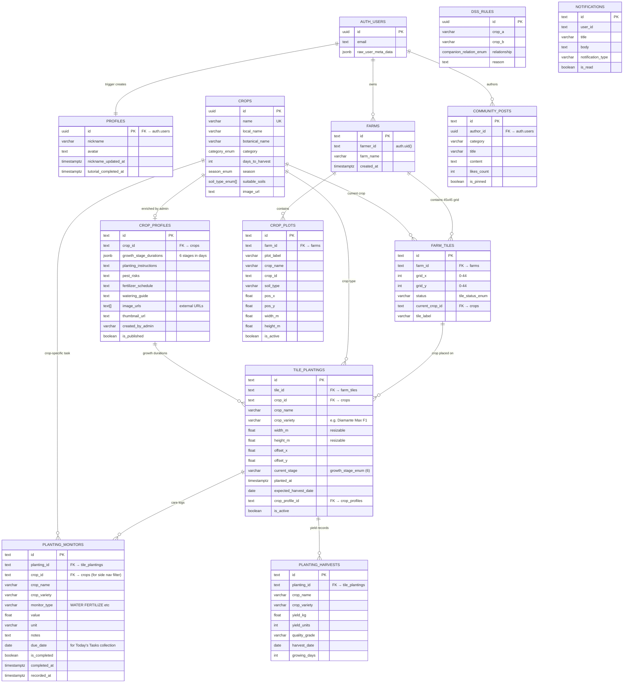
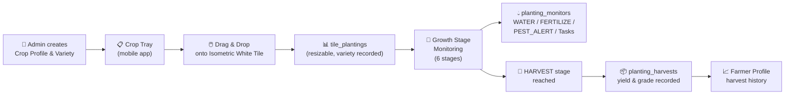

# MapTanim Database Schema — Crop Lifecycle ERD

Complete entity-relationship diagram for the MapTanim Supabase PostgreSQL schema,
including the new crop lifecycle tables from Migration 013.

## Auth Model

| User Type | Auth Method | Database Presence |
|-----------|------------|-------------------|
| **Admin** (Web) | Vercel env variables (`VITE_ADMIN_EMAIL`/`VITE_ADMIN_PASSWORD`) | No `auth.users` row — uses Supabase service_role key for writes |
| **Farmer** (Mobile) | Supabase Auth (Email/OTP) | `auth.users` row → auto-creates `profiles` row via trigger |

## Full ERD

## Crop Lifecycle Flow

## Monitoring & Today's Tasks Navigation Design

### 1. Monitoring Dashboard (Plot-First Design)
* **Full Landscape Width Grid**: Displays active planted crops directly from the isometric farm plots (`crop_plots`). No arbitrary catalog filtering sidebar or unplanted crops.
* **Plot Context on Every Card**:
  * **Plot Label**: Identified by assigned plot (e.g. `Plot 1`, `Plot 2`).
  * **Plot Soil Type Badge**: Static soil assigned to that plot (e.g., `Loam Soil`, `Clay Soil`) from agricultural classification.
  * **Seasonal Window Badge**: Growing window for the crop (e.g., `☀️ Tag-araw (Dry)`, `🌧️ Tag-ulan (Wet)`, `🔄 Buong Taon (Year-Round)`).
  * **Growth Progress**: Days planted vs. days to harvest with active 5-stage progress indicator.
* **Screen 2 DSS Panels**: Tapping any plot card opens the 6 operational DSS panels for that specific planted crop (`Overview`, `Timeline`, `Calendar`, `Companions`, `Growing Tips`, `Pest & Disease`).

### 2. Today's Tasks Screen
* **Aggregate Today's Tasks**: Collects all tasks scheduled for the current date across all active farm plots (`due_date <= CURRENT_DATE` and `is_completed = FALSE`).
* **Direct Plot Task List View**: When a farmer taps a task card, the app allows direct completion (watering, fertilizer, weeding) which updates the plot's health and stage tracking.

## Growth Stages (Canonical 5-Stage Timeline)

| # | Stage | Description | Typical Progress |
|---|-------|-------------|-----------------|
| 1 | `SPROUT` | Seed emergence / initial sprouting | 0–15% |
| 2 | `SEEDLING` | Early root establishment and true leaves | 15–35% |
| 3 | `VEGETATIVE` | Rapid stem & foliage development | 35–65% |
| 4 | `FLOWERING` | Budding, pollination & fruit/pod formation | 65–90% |
| 5 | `HARVEST` | Full maturity, ready for harvesting & logging | 90%+ |
