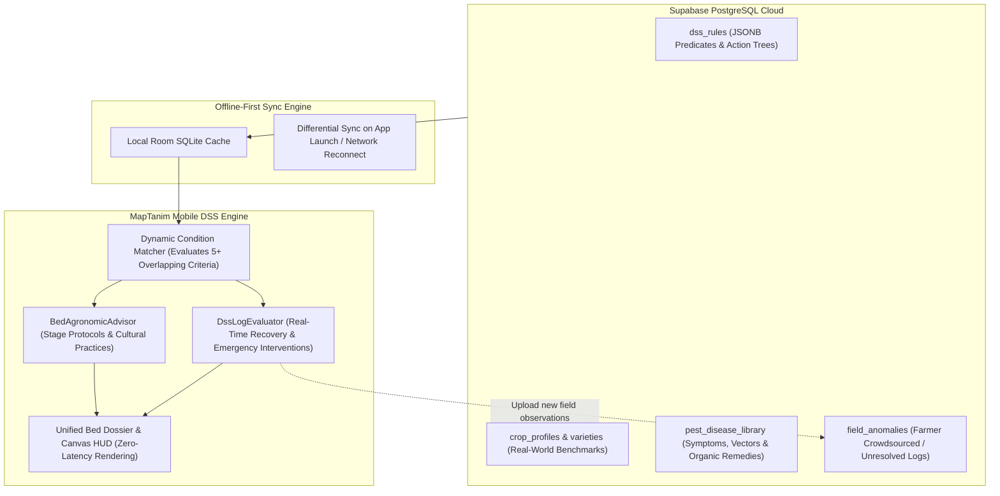

# 20. Decision Support System (DSS) & Crop Monitoring

> 📌 **Navigation**: [◀ 19. Edit Mode](file:///d:/Development/MapTanim/docs/19_EDIT_MODE.md) | [🏠 Master Index](file:///d:/Development/MapTanim/docs/README.md) | [21. Knowledge Base ▶](file:///d:/Development/MapTanim/docs/21_KNOWLEDGE_BASE.md)

---

## 📌 Overview

The **DSS Engine** is the rule-based decision-support core of MapTanim. It uses farmer-provided farm information, crop information, planting dates, crop growth timelines, seasonality references, companion-planting rules, soil-crop suitability references, and farmer-recorded activities or observations to produce recommendations and actionable tasks.

MapTanim is **not an IoT monitoring system**. The DSS does not receive data from soil sensors, weather stations, irrigation controllers, field sensors, satellite feeds, or other connected agricultural hardware.

The DSS powers two primary user-facing systems:

1. **TODAY'S TASKS (`TodaysTasksOverlay.kt`)**
   - Shows actionable agricultural tasks generated from predefined rules.
   - Tasks may include:
     - 💧 **Water Recommendation**
     - 🌿 **Fertilize Recommendation**
     - 🔎 **Crop Inspection / Scouting**
     - 🛠️ **Crop Care / Support Recommendation**
     - 🌾 **Harvest**
     - 🐛 **Pest / Disease Follow-up**
   - Completed tasks are recorded as farm activity history.
   - Task generation is based on crop schedule, simulation day, growth stage, predefined crop rules, and recorded activities.
   - Tasks are **recommendations and reminders**, not automatic control commands.

2. **MONITORING DASHBOARD SYSTEM (`MonitoringDashboardOverlay.kt`)**
   - Provides the crop monitoring hub with 6 dedicated panels:
     - **My Plants**
     - **Timeline**
     - **Calendar**
     - **Companions**
     - **Growing Tips**
     - **Pest & Disease Control**
   - Monitoring begins from the **planting event recorded in the Calendar**.
   - The planting date is the official **Simulation Day 0**.
   - The system calculates the current simulation day from the planting date and the current date.
   - The dashboard displays the crop's current growth stage, progress, expected harvest, recommendations, and recorded status.

---

## 📌 Strategic Objectives & Defined Scope

### Core Philosophy
MapTanim's Decision Support System is **not a passive encyclopedia** and **not an abstract drawing tool**. It is a **context-aware diagnostic and agronomic decision engine** that evaluates the farmer's raw observations (e.g. Murcia, elevation, dark volcanic soil, wet season, unlabelled market seeds, ₱0 budget) and delivers **immediate, zero-cost, locally available actions**.

### Strategic Objectives
1. **OBJ-1: Context-Grounding Without Jargon**: Translate raw backyard observations (e.g., *"dark brown soil"*, *"rainy season"*, *"plants flopping over"*, *"chickens scratching"*) into agro-ecological parameters without expecting the user to know scientific terminology.
2. **OBJ-2: ₱0 Budget & Local Resource Equity**: Deliver solutions using **only household and backyard items** (wood ash, crushed eggshells, chili-garlic-soap spray, bamboo stakes, dried leaf mulch, thorn branch barriers). No requirement for commercial chemical pesticides or expensive tools.
3. **OBJ-3: Lifecycle-Progressive Guidance**: Deliver the right advice at the right time. A user at Day 3 needs soil prep instructions, not harvesting advice. A user at Day 45 needs trellising and blossom-care, not seed germination tips.
4. **OBJ-4: Multi-Factor Symptom Disambiguation**: Prevent misdiagnosis by isolating root causes through visual questions (e.g., Blossom-End Rot vs Fruitworm vs Sunscald; Overwatering vs Underwatering vs Nitrogen deficiency).
5. **OBJ-5: Mechanical & Physical Protection Guidance**: Recognize that biology is only half the battle; physical intrusion (chickens, dogs, family traffic, wind damage, sprawling vines) requires immediate physical solutions (staking, thorn barriers, figure-8 knots).
6. **OBJ-6: Harvest Longevity & Crop Rotation Intelligence**: Clarify the "Pull vs. Pick" rule (Single-harvest Pechay vs. Multi-pick Tomato/Sitaw over 60 days) and automatically prescribe the next rotation crop to restore soil fertility naturally.

### Defined Scope
* **In-Scope**:
  - 10 canonical Philippine backyard crops (Tomato, Eggplant, Pepper/Sili, Sitaw, Okra, Pechay, Lettuce, Kangkong, Cucumber, Sweet Corn).
  - 7 continuous lifecycle phases (Pre-planting, Sowing, Seedling Care, Vegetative/Mechanical, Flowering/Pollination, Multi-Pick Harvest, Soil Succession).
  - Multi-pillar diagnostic engine with zero-budget household remedies.
  - Spatial scaling calibrated against real-world backyard yard measurements (step pacing guide: 1 step ≈ 0.85m, Courtyard 6m×4m, Backyard 12m×8m, Spacious 18m×12m, with customizable metric boundaries).
* **Out-of-Scope**:
  - Commercial synthetic agrochemical regimens requiring licensed applicator certifications.
  - Industrial monoculture machinery (tractors, combine harvesters).
  - IoT sensor hardware dependencies (electronic soil moisture probes, automated solenoid valves).

---

## 📌 Complete Agricultural Cycle: Case-to-Case Problem Breakdown

```mermaid
flowchart TD
    subgraph S1["Phase 1: Pre-Planting & Site Realities"]
        P1["Heavy, rock-hard or sticky clay soil (volcanic/sugarcane)"]
        P2["Unknown repacked market seeds (no variety label, no expiry)"]
        P3["Obstacles: coconut tree shade, no garden hose, water pressure issues"]
    end

    subgraph S2["Phase 2: Germination & Early Seedling"]
        P4["Burying tiny seeds too deep (3–5cm instead of 1cm) -> seeds rot"]
        P5["Chickens, cats, and household members digging or pulling seedlings"]
        P6["Damping-Off ('Hulas'): stem rots at soil line from excess moisture"]
        P7["'Leggy' seedlings: skinny, weak thread-stems stretching for sunlight"]
    end

    subgraph S3["Phase 3: Vegetative Growth & Nutrition"]
        P8["Overcrowding: 20 seedlings in one clump; fear of thinning them out"]
        P9["Fertilizer burn: dumping raw chicken manure directly onto roots"]
        P10["Yellow leaves: Is it overwatering, lack of nitrogen, or normal shedding?"]
        P11["Weed invasion competing for root space and water"]
    end

    subgraph S4["Phase 4: Structure, Flowering & Fruit Set"]
        P12["Stem flopping over in the mud; soft watery body unable to hold weight"]
        P13["Trellising confusion: what to use, how to tie without strangling stem"]
        P14["Blossom Drop ('Laglag-Bulaklak'): flowers dry up and fall without fruiting"]
        P15["Lack of pollination during rainy days when bees are absent"]
        P16["Excessive 'Suhi' (suckers): bush of leaves with zero fruit"]
    end

    subgraph S5["Phase 5: Pests, Pathogens & Physical Damage"]
        P17["Chewing pests: green hornworms, fruitworms burrowing into tomatoes"]
        P18["Sucking pests: aphids/whiteflies under leaves causing curling and mosaic virus"]
        P19["Rain-splash fungal leaf spot: raindrops splashing soil mud onto lower leaves"]
        P20["Blossom-End Rot: black, sunken leathery bottoms on fruit (Calcium/water issue)"]
        P21["Fruit cracking/splitting after a sudden heavy downpour"]
        P22["Bacterial Wilt: plant looks fine at 8 AM, completely dead by 3 PM"]
    end

    subgraph S6["Phase 6: Harvesting & Multi-Cycle Management"]
        P23["Timing: picking too early (acidic/green) vs too late (woody/rotted)"]
        P24["Technique: pulling the entire plant vs continuous multi-picking"]
        P25["Frequency: not knowing that picking stimulates MORE flowers"]
        P26["Harvest Longevity: how many harvests before the plant is exhausted and the bed must be cleared?"]
    end

    subgraph S7["Phase 7: Post-Harvest & Soil Regeneration"]
        P27["Soil exhaustion & nematode buildup from replanting the same crop"]
        P28["Succession confusion: 'What vegetable should go into this bed next?'"]
    end

    S1 --> S2 --> S3 --> S4 --> S5 --> S6 --> S7
```



---

## 📌 Post-Account Creation: Initial DSS Observation & Availability Setup

Immediately after registration, the user defines their current local status through a guided DSS setup:

1. **Location / Agro-Zone Dropdown**:
   - `Highland / Mountain Slope (>500m, e.g. Murcia, Benguet, Bukidnon)`
   - `Lowland Flatland (0–500m, e.g. Central Luzon, coastal plains)`
2. **Current Weather / Season Dropdown**:
   - `Rainy / Wet Season (Frequent downpours, high humidity)`
   - `Dry / Hot Sunny Season (Intense heat, drought risk)`
3. **Soil Appearance & Texture Dropdown**:
   - `Dark Brown / Volcanic (High organic matter, heavy clay-loam, acidic)`
   - `Heavy Clay Soil (Sticky mud when wet, rock-hard when dry)`
   - `Sandy / Light Soil (Drains rapidly, dries quickly)`
   - `Loam / Garden Soil (Crumbly, balanced moisture)`
4. **Backyard Yard Dimensions & Boundary Guide (Real-World Metric Measurement)**:
   - `Courtyard / Balcony Garden (6m × 4m • 24m²)`
   - `Standard Backyard Plot (12m × 8m • 96m²)`
   - `Spacious Backyard / Farmlet (18m × 12m • 216m²)`
   - `Custom Exact Dimensions (Meters, with step-pacing guide: 1 step ≈ 0.85m)`
5. **Local Site Observations & Risks (Multi-Select Chips)**:
   - `Free-range Chickens / Stray Animals present`
   - `Natural Slope (Good runoff / no water stagnation)`
   - `Prone to Water Pooling / Flooding`
   - `Partial Shade (< 5 hours direct sunlight)`
   - `Strong Wind Exposure`
6. **Available Zero-Budget Household Materials (Multi-Select Chips)**:
   - `Wood Ash (Abo) from stove/charcoal`
   - `Crushed Eggshells`
   - `Dried Leaves / Rice Straw (Dayami) for mulch`
   - `Bamboo Poles / Tree Branch Stakes`
   - `Kitchen Chili & Garlic (for organic insect spray)`

---

## 📌 Complete Agricultural Cycle: Real-World Case Breakdown & Dynamic Engine

### 1. Concrete Case: Beginner in Murcia (Flat Volcanic Soil, No Flooding, Kitchen Seeds, Zero Budget)

| Step | Reality in the Field | MapTanim DSS Guidance & Real-Time Action |
| :--- | :--- | :--- |
| **1. Tool Acquisition** | User has no commercial farm tools (no spade, no hoe, no seedling trays). | **Zero-Budget Tool Substitutions:**<br>• Used plastic egg trays / paper cups / tin cans with punctured drainage holes = seedbox nursery.<br>• Old kitchen tablespoon = planting & transplanting trowel.<br>• Sharpened bamboo stick = dibber for hole depth and row marking.<br>• 1.5L Coke bottle with needle-punctured cap = gentle nursery water sprinkler. |
| **2. Land Preparation** | Murcia sugarcane/volcanic soil is heavy clay-loam: sticky mud during rains, rock-hard when baked by sun. | **Soil Conditioning Protocol:**<br>• Dig and break up clods to 30cm depth.<br>• Blend in 3–5 kg/m² decomposed organic compost or carbonized rice hull (CRH) to open air pores.<br>• Dust wood ash (*abo*) lightly to neutralize volcanic acidity.<br>• Build raised garden beds (20–30cm elevated above ground level) to guarantee drainage even in flat terrains. |
| **3. Planting Kitchen Seeds** | Seeds rescued from kitchen vegetables (tomatoes, bell peppers, squash) have unknown germination viability. | **Seed Rescue & Sowing Protocol:**<br>• **Paper Towel Test:** Wrap 10 seeds in a damp paper towel or cloth for 4 days. If $\ge 7$ sprout, viability is high.<br>• **Seed Depth Rule:** SOW SHALLOW ($< 1\text{cm}$ deep or twice the seed width). **Never bury 3–5cm deep**, which causes seed rot (*P4*).<br>• Water with fine mist so seeds are not dislodged. |
| **4. Care & Maintenance** | Seedlings emerge; risk of leggy stems and overcrowding. | **Care Protocol:**<br>• **Morning Sunlight:** Minimum 6 hours direct sun to prevent spindly "leggy" stems (*P7*).<br>• **Root-Zone Watering:** Apply water at the base before 9:00 AM. Keep foliage dry to prevent rain-splash fungal infection (*P19*).<br>• **Organic Mulching:** Cover bare bed soil with dried rice straw (*dayami*) or dried leaves to conserve moisture and suppress weeds (*P11*). |
| **5. Handling Unexpected Anomalies** | Household realities: brother pulled a plant, stray chickens scratched the bed, or stem rots at ground level. | **Immediate Recovery Steps:**<br>• **Brother pulled plant / accidental loss:** Inspect adjacent plant spacing. If gap $> 40\text{cm}$, transplant a companion (e.g., Pechay or Marigold) to fill the root niche.<br>• **Chicken / animal scratch damage:** Smooth disturbed soil around roots; erect protective bamboo stick spikes (*suksok*) around bed perimeter or drape scrap fish netting.<br>• **Rotten stem / 'Hulas' (Damping-off):** Immediately stop surface watering. Scrape away damp topsoil and dust dry wood ash (*abo*) around the collar line to desiccate fungal mycelium. |
| **6. Harvest Longevity & Bed Clearance (P26)** | Confusion over how many harvests before a plant is finished and the bed must be cleared. | **Crop-Specific Picking Lifespans:**<br>• **Pechay / Mustard:** Single harvest (Day 25–35). Cut whole head at base; clear bed immediately.<br>• **Sitaw (Pole Beans):** 15–20 pickings over 45 days. Pick every 2–3 days while pencil-thick.<br>• **Tomato:** 6–8 pickings over 30–45 days. Harvest at breaker stage (pink blush).<br>• **Eggplant:** 20–30 pickings over 4–6 months.<br>• **Clearance Signal:** When leaves turn uniformly yellow, fruit size shrinks by 60%, or stems become woody/barren, pull entire root system, compost clean biomass, and prepare for crop succession. |
| **7. Crop Succession & Rotation** | Soil is exhausted of specific nutrients; nematode eggs remain. | **Botanical Succession Rule:**<br>• **Solanaceae (Tomato/Eggplant/Pepper)** $\to$ followed by **Legume (Sitaw/Mongo)** to inject atmospheric nitrogen back into soil $\to$ followed by **Leafy Greens (Pechay/Lettuce)** $\to$ followed by **Root Crops (Radish/Carrot)**. |

---

### 2. Database-Driven DSS & Crop Library Architecture (Beyond Static Hardcoding)

A major design goal of MapTanim is to **avoid static hardcoding** so that complex, multi-condition agricultural knowledge does not require app recompilation or app store releases. The system uses a **Database-Backed Hybrid Architecture**:



#### A. How Real Data is Checked (vs. Static Hardcoding)
1. **Dynamic Predicate Storage (`dss_rules` table)**:
   - Rules are stored as JSONB condition trees rather than rigid code branches.
   - Example multi-condition database rule for a flat volcanic backyard with kitchen seeds:
     ```json
     {
       "rule_id": "rule_murcia_volcanic_flat_kitchen_prep",
       "conditions": {
         "agro_zone": "MURCIA",
         "topography": "FLAT",
         "flood_risk": false,
         "soil_texture": "VOLCANIC_CLAY",
         "seed_source": "KITCHEN_REPACKED",
         "stage": "PREPARATION"
       },
       "recommendation": {
         "title": "Raised Bed & Paper-Towel Germination Protocol",
         "actions": [
           "Perform 4-day damp paper towel test for kitchen seeds before bed sowing.",
           "Dig heavy clay-loam to 30cm depth; blend 3kg/m² organic compost or carbonized rice hull.",
           "Dust 200g/m² wood ash (abo) to neutralize volcanic acidity.",
           "Build raised beds (20–30cm) to guarantee aeration even in flat non-flooded terrain."
         ],
         "urgency": "HIGH",
         "household_substitutions": ["egg_tray_nursery", "kitchen_spoon_trowel", "needle_punctured_bottle"]
       }
     }
     ```
2. **Dynamic Rule Matching in Mobile Engine**:
   - The mobile engine loads cached rules into memory.
   - When evaluating a bed or log, the engine matches the farmer's current environmental profile and observation flags against the rule conditions.
   - Rules are scored by **specificity (number of matching predicates)**: a rule specifically matching Murcia + Flat + Volcanic Clay outranks a generic nationwide clay rule.

#### B. Dynamic Crop Library Integration
- Crop benchmarks (germination days, planting depth, picking lifespan, harvest frequency, yield estimates, companion affinities) live in the `crop_profiles` table.
- When new crop varieties (e.g., *Murcia Sweet Corn* or *Bacolod Pole Sitao*) are cataloged, administrators add them to Supabase.
- The mobile app automatically receives the new crop parameters on the next sync without needing a code update.

#### C. Handling Multi-Condition Overload & Reporting Field Anomalies
- **What happens when there are too many conditions?**
  - If a situation matches multiple rules simultaneously (e.g. "Chicken Scratch" + "Stem Rot" + "Overcrowded Clump"), the DSS aggregates actions and sorts them by **Urgency/Priority**:
    1. **Priority 2 (Emergency Quarantine/Survival):** Halt water & apply wood ash to stem rot; firm soil and erect bamboo spikes against chickens.
    2. **Priority 1 (Cultural Care):** Thin overcrowded clumps down to 1 seedling per station.
    3. **Priority 0 (Standard Routine):** Maintain base watering before 9:00 AM.
- **Can farmers send new field anomalies back to the library?**
  - YES. When a farmer encounters an unclassified symptom or unexpected household anomaly, the app logs the observation to the `field_anomalies` table in Supabase.
  - Agricultural extension agents can review these logs, update or add new recovery rules in the database, and publish them immediately to all farmers in the area.

---

## 🔹 Monitoring Lifecycle

The crop lifecycle follows one continuous flow:

```text
CALENDAR
   ↓
Farmer records planting event
   ↓
Planting Date = Simulation Day 0
   ↓
Create Active Crop Instance
   ↓
Monitoring Engine calculates:
   - days planted
   - growth stage
   - days remaining
   - progress
   ↓
DSS evaluates predefined rules
   ↓
Generate recommendations / Today's Tasks
   ↓
Farmer performs or records the recommended activity
   ↓
Activity is saved
   ↓
Monitoring continues using the updated farm record
   ↓
Harvest Ready
   ↓
Harvest Record
```

### Important Rule

The system does **not** use an app-open timer or background game loop to advance crop growth.

Instead:

```text
daysPlanted = currentDate - plantedDate
```

Therefore:

- Planting date = Day 0
- The following calendar date = Day 1
- The crop continues progressing even when the application is closed.
- Reopening the application recalculates the correct simulation day from the stored planting date.

---

## 🔹 DSS Inputs

| Input | Source | Example |
|---|---|---|
| Farm / crop zone layout | Local farm data / Room DB | Carrot Zone — Carrot, 2m × 2m |
| Crop assignment | Farm crop zone record | Carrot Zone = Carrot |
| Crop data | Crop catalog | Carrot: growth timeline, care rules |
| Planting date | Calendar planting event | 2026-08-07 |
| Current date | Device/system date | 2026-08-13 |
| Crop variety | Crop/variety data | Standard / selected variety |
| Growth timeline | Crop knowledge base | Stage durations and harvest duration |
| Seasonality | Preloaded agricultural reference | Wet / Dry / Year-Round |
| Soil type | Farmer-selected / farmer-provided input | LOAM |
| Soil-crop rules | Knowledge base | Carrot → suitable for Loam |
| Companion rules | Companion planting matrix | Tomato + Carrot = Beneficial |
| Activity history | Farmer-recorded activities | Last watering, fertilizing, weeding |
| Plant observations | Farmer-entered observation | Yellow leaves, visible pest symptoms |
| DSS rules | `DssEngine.kt` rule set | Stage + schedule + crop rule |

### Inputs explicitly excluded

The DSS does **not** use:

- IoT sensors
- Soil moisture sensors
- NPK sensors
- pH sensors
- Temperature sensors
- Humidity sensors
- Rain gauges
- Weather stations
- Weather APIs
- Real-time weather feeds
- Satellite monitoring
- NDVI
- Automated remote sensing
- Automatic field measurements

---

## 🔹 DSS Outputs & Navigation Breakdown

| Output | Component / Display Location | Interactive Behavior |
|---|---|---|
| **WATER Recommendation** | `TodaysTasksOverlay.kt` + optional canvas status pin | Opens watering guidance and records completion |
| **FERTILIZE Recommendation** | `TodaysTasksOverlay.kt` + optional canvas status pin | Opens fertilizer guidance and records completion |
| **CROP INSPECTION Task** | `TodaysTasksOverlay.kt` + optional canvas status pin | Opens observation form |
| **CARE / SUPPORT Task** | `TodaysTasksOverlay.kt` + optional canvas status pin | Opens crop-care guidance |
| **HARVEST Task** | `TodaysTasksOverlay.kt` + canvas harvest indicator | Opens harvest recording |
| **PEST / DISEASE FOLLOW-UP** | `TodaysTasksOverlay.kt` + optional canvas status pin | Opens reference/intervention guidance and observation form |
| **Planting / Pending Badge** | 2D Canvas (`FarmCanvasRenderer.kt`) | Indicates a planted record whose monitoring cycle has not been initialized or confirmed |
| **Monitoring Hub** | `MonitoringDashboardOverlay.kt` | Opens from top bar or selected crop on the farm map |

> **Important:** DSS outputs are recommendations, reminders, and guidance. MapTanim does not automatically operate irrigation equipment, fertilizer equipment, pesticide equipment, or any other physical farm device.

---

## 🔹 Monitoring Dashboard Hub Architecture

The **Monitoring Dashboard Overlay** (`MonitoringDashboardOverlay.kt` & `MonitoringViewModel.kt`) is a crop-management hub featuring 6 navigation panels.

### 1. My Plants Panel

- **Planted Crops Inventory**: Displays all active crop instances assigned to farm crop zones.
- **Planting Start Date**: Displays the exact `plantedDate`.
- **Crop Identity**: Displays crop name, variety when available, category, crop zone, and farmer-selected soil information.
- **Simulation Information**:
  - `daysPlanted`
  - `daysToHarvest`
  - progress percentage
  - current growth stage
- **Monitoring State**:
  - `PENDING`
  - `ACTIVE`
  - `HARVEST_READY`
  - `HARVESTED`
- A crop's monitoring lifecycle is anchored to its planting date.

### 2. Timeline Panel

Displays the visual crop-growth progression.

**Standard five-stage model:**

1. `Sprout` — Germination / Emergence
2. `Seedling` — Early Leaf Development
3. `Vegetative` — Stem and Leaf Expansion
4. `Flowering / Fruiting / Podding` — Crop-specific reproductive stage
5. `Harvest Ready` — Crop reaches the predefined harvest threshold

The actual stage boundaries come from the selected crop/variety timeline.

The Timeline displays:

- Current stage
- Days planted
- Total growth duration
- Days remaining to harvest
- Progress percentage

### 3. Calendar Panel

The Calendar has two distinct responsibilities:

#### A. Planting Schedule

The farmer selects or confirms the planting date.

That planting event becomes:

```text
Simulation Day 0
```

#### B. Agricultural Event Calendar

The Calendar can display:

- Planting date
- Scheduled care dates
- Recommended fertilization dates
- Inspection/scouting dates
- Expected harvest date
- Recorded harvest date

Seasonality is used as a **reference for planting recommendations**, not as a source of live weather conditions.

The Calendar does **not** pull weather data and does not adjust tasks from live weather.

### 4. Companion Planting Panel

- Evaluates active crop zone assignments using the companion planting matrix.
- Displays:
  - **BENEFICIAL**
  - **NEUTRAL**
  - **ANTAGONIST**
- Shows the reason/reference stored for the relationship when available.
- If no companion is assigned, display:
  - `No companion assigned`
- `No companion assigned` must **not** be interpreted as `Compatible`.

### 5. Growing Tips Panel

Provides reference-based agricultural recommendations relevant to the selected crop and, when applicable, its current growth stage.

Examples:

- suitable soil classification
- sunlight requirement
- planting depth
- spacing
- support structure
- watering guidance
- fertilization guidance
- pruning guidance
- cultivation practices
- harvest preparation

The panel provides **guidance only**. It does not measure whether the recommendation has physically been satisfied.

### 6. Pest & Disease Control Panel

Provides reference-based pest and disease guidance.

It may display:

- common pests
- common diseases
- symptoms
- prevention practices
- scouting instructions
- biological control references
- chemical control references when included in the approved knowledge base

A pest or disease reference is **not automatically proof that the crop has the problem**.

A more specific intervention recommendation should require a farmer-recorded observation or another applicable rule condition.

---

## 🔹 Today's Tasks Generation Rules

Today's Tasks are generated from predefined rules.

They are **not generated from IoT sensor readings or weather APIs**.

### Water Recommendation Rule

```text
IF crop is actively monitored
AND watering schedule is due
AND the crop has not been recorded as watered
    according to the configured care interval
THEN generate WATER recommendation
```

The interval comes from the crop knowledge base.

Example:

```text
wateringIntervalDays = 1
lastWateredDate = 2026-08-12
currentDate = 2026-08-13

→ WATER recommendation
```

The rule does not claim that soil is currently dry.

It means:

> According to the crop's predefined care schedule, watering is due.

---

## 🔹 Fertilize Recommendation Rule

```text
IF crop is actively monitored
AND current growth stage requires fertilization
AND the configured fertilization event is due
THEN generate FERTILIZE recommendation
```

The rule is based on crop and growth-stage guidance.

It does not measure soil nutrients.

Example:

```text
Stage = Vegetative
Fertilization event = Day 10
Simulation Day = 10

→ FERTILIZE recommendation
```

---

## 🔹 Crop Inspection / Scouting Rule

```text
IF crop is actively monitored
AND scheduled inspection/scouting interval is due
THEN generate INSPECT / SCOUT task
```

Example:

```text
Inspection interval = 7 days
Last inspection = 2026-08-06
Current date = 2026-08-13

→ INSPECT task
```

After the farmer completes the inspection, the system records the activity.

The inspection task means:

> Check the crop physically and optionally record observations.

It does **not** mean the application already detected a problem.

---

## 🔹 Care / Support Rule

```text
IF current growth stage requires a crop-specific care action
AND the configured action is due
THEN generate CARE / SUPPORT task
```

Examples:

- Check trellis/support for climbing crops
- Weed around crop area
- Check pruning requirements
- Check spacing or plant development
- Prepare harvest support materials

These are recommendation tasks based on the crop knowledge base.

---

## 🔹 Harvest Task Rule

```text
IF (currentDate - plantedDate) >= crop.totalGrowthDurationDays
THEN generate HARVEST task
AND set crop state = HARVEST_READY
```

The harvest date is therefore calculated from the planting date and the configured crop/variety timeline.

Example:

```text
Planting Date = 2026-08-07
Total Duration = 60 days
Current Date = 2026-10-06

→ HARVEST_READY
→ Generate HARVEST task
```

The task opens the harvest record form where the farmer can record:

- harvest date
- crop zone
- crop
- quantity/yield
- notes

---

## 🔹 Pest / Disease Follow-up Rule

Pest and disease tasks are not generated simply because a pest exists somewhere in the crop database.

A recommended pest/disease follow-up may be generated when the applicable predefined rule is satisfied.

Examples:

```text
IF scheduled scouting is due
THEN generate INSPECT task
```

or:

```text
IF farmer records a visible symptom
AND the symptom matches a stored reference rule
THEN generate PEST / DISEASE FOLLOW-UP
```

The output should be phrased as:

```text
Possible Cause
Recommended Inspection
Suggested Intervention
```

rather than claiming automatic diagnosis.

---

# 🔹 Growth Stage Calculator

Growth is calculated from the planting date.

```kotlin
// VarietyGrowthCalculator.kt

fun calculate(
    plantedDate: LocalDate,
    today: LocalDate,
    stage1Days: Int,
    stage2Days: Int,
    stage3Days: Int,
    stage4Days: Int,
    totalDurationDays: Int
): VarietyGrowthInfo {

    val daysPlanted =
        ChronoUnit.DAYS.between(plantedDate, today)
            .toInt()
            .coerceAtLeast(0)

    val stage2Threshold = stage1Days
    val stage3Threshold = stage1Days + stage2Days
    val stage4Threshold = stage1Days + stage2Days + stage3Days
    val stage5Threshold = totalDurationDays

    val (stage, stageName) = when {
        daysPlanted < stage2Threshold ->
            1 to "Stage 1 (Sprout)"

        daysPlanted < stage3Threshold ->
            2 to "Stage 2 (Seedling)"

        daysPlanted < stage4Threshold ->
            3 to "Stage 3 (Vegetative)"

        daysPlanted < stage5Threshold ->
            4 to "Stage 4 (Flowering/Fruiting)"

        else ->
            5 to "Stage 5 (Harvest Ready)"
    }

    val daysRemaining =
        (totalDurationDays - daysPlanted)
            .coerceAtLeast(0)

    val progress =
        if (totalDurationDays > 0) {
            (daysPlanted.toFloat() / totalDurationDays.toFloat())
                .coerceIn(0.0f, 1.0f)
        } else {
            1.0f
        }

    return VarietyGrowthInfo(
        currentStage = stage,
        stageName = stageName,
        daysPlanted = daysPlanted,
        daysRemainingToHarvest = daysRemaining,
        progressPercentage = progress
    )
}
```

### Core rule

```text
plantingDate = Day 0

simulationDay =
    difference between currentDate and plantingDate
```

The simulation should never depend on:

- application uptime
- frame rate
- background timer
- device sensor input
- weather service

---

# 🔹 Crop Instance State

Every planted crop should be treated as a distinct **Crop Instance**.

Example:

```text
Crop Instance
-----------------------------
id
farmId
cropZoneId
cropId
cropName
varietyId
plantedDate
totalGrowthDurationDays
monitoringStatus
```

Example:

```text
PLANT-002
Crop: String Beans
Crop Zone: String Beans Zone 1
Planted: 2026-08-07
Duration: 60 days
Status: ACTIVE
```

If the same crop is planted in three different crop zones, they are three separate crop instances:

```text
PLANT-002 → String Beans → String Beans Zone 1
PLANT-003 → String Beans → String Beans Zone 2
PLANT-004 → String Beans → String Beans Zone 3
```

This prevents tasks and monitoring records from being incorrectly merged.

---

# 🔹 Activity Records

Completing a task should create an activity record instead of simply deleting the task.

Example:

```text
Activity
-----------------------------
id
cropInstanceId
cropZoneId
activityType
activityDate
notes
```

Possible activity types:

```text
WATERED
FERTILIZED
INSPECTED
WEEDING
PRUNED
SUPPORT_CHECK
HARVESTED
OBSERVATION_RECORDED
```

Example:

```text
WATERED
Crop: String Beans
Crop Zone: String Beans Zone
Date: 2026-08-13
```

This activity history can then be used when the DSS determines whether a scheduled task is due.

---

# 🔹 Monitoring Status Model

The monitoring system should use a clear state model:

```text
PLANTED / PENDING
      ↓
ACTIVE MONITORING
      ↓
GROWING
      ↓
HARVEST READY
      ↓
HARVESTED
      ↓
COMPLETED
```

### PENDING

Crop has been assigned to a crop zone but the planting event has not yet established the simulation start.

### ACTIVE MONITORING

Planting date is established and the crop simulation is running.

### GROWING

The crop is within its growth timeline.

### HARVEST READY

The predefined crop/variety growth duration has been reached.

### HARVESTED

The farmer recorded the harvest.

### COMPLETED

The crop instance is closed and moved to history.

---

# 🔹 Soil-Crop Suitability Recommendations

Soil is used as a **decision-support input**, not as an automatically measured environmental value.

The farmer selects or confirms a soil classification.

```kotlin
fun calculateSoilSuitability(
    soilType: SoilType,
    crop: Crop
): Float {

    return when {
        soilType in crop.idealSoils -> 1.0f
        soilType in crop.suitableSoils -> 0.75f
        soilType in crop.toleratedSoils -> 0.50f
        else -> 0.25f
    }
}
```

The meaning is:

```text
100% → Optimal Match
75%  → Suitable
50%  → Marginal / Tolerated
25%  → Poor Match
```

These scores are used to support recommendations such as:

```text
Recommended
Suitable
Use With Caution
Not Recommended
```

They do **not** represent a laboratory soil measurement.

---

## 🔹 Crop Soil Suitability Reference

| Crop | Ideal Soils | Suitable | Tolerated |
|---|---|---|---|
| Tomato | LOAM | SANDY, SILTY | CLAY |
| Eggplant | LOAM, CLAY | SILTY | SANDY |
| Cabbage | LOAM, CLAY | SILTY | SANDY |
| Carrot | SANDY, LOAM | SILTY | — |
| Lettuce | LOAM | SILTY, CLAY | — |
| Cucumber | LOAM, SANDY | SILTY | CLAY |
| Onion | LOAM, SANDY | SILTY | CLAY |
| String Beans | LOAM | SANDY, SILTY | CLAY |
| Corn | LOAM, CLAY | SILTY | SANDY |
| Squash | LOAM, CLAY | SILTY | — |
| Okra | LOAM, SANDY | SILTY | CLAY |
| Bell Pepper | LOAM | SANDY, SILTY | CLAY |
| Kangkong | CLAY, LOAM | SILTY | SANDY |

---

# 🔹 Companion Planting Matrix

The companion system evaluates crop pairs using predefined relationships:

- `BENEFICIAL`
- `NEUTRAL`
- `ANTAGONIST`

Example:

| Crop A | Crop B | Relationship |
|---|---|---|
| Tomato | Lettuce | BENEFICIAL |
| Tomato | Carrot | BENEFICIAL |
| Tomato | Eggplant | ANTAGONIST |
| Tomato | Cabbage | ANTAGONIST |
| Eggplant | String Beans | BENEFICIAL |
| Eggplant | Cucumber | NEUTRAL |
| Cucumber | Corn | BENEFICIAL |
| Cucumber | Potato | ANTAGONIST |
| Cabbage | Onion | BENEFICIAL |
| Cabbage | String Beans | ANTAGONIST |
| Onion | Carrot | BENEFICIAL |
| Onion | String Beans | ANTAGONIST |
| Lettuce | Carrot | BENEFICIAL |
| Lettuce | Cucumber | BENEFICIAL |
| Corn | Squash | BENEFICIAL |
| Corn | Kangkong | NEUTRAL |
| Okra | Tomato | BENEFICIAL |
| Squash | Okra | NEUTRAL |
| Bell Pepper | Carrot | BENEFICIAL |
| Bell Pepper | Eggplant | ANTAGONIST |

### Important UI rule

```text
String Beans + None assigned
```

must display:

```text
No companion assigned
```

It must not automatically display:

```text
Compatible
```

---

# 🔹 DssEngine.kt

The DSS engine combines monitoring calculations and predefined agricultural rules.

```kotlin
// dss/engine/DssEngine.kt

class DssEngine @Inject constructor(
    private val growthCalculator: GrowthStageCalculator,
    private val companionMatrix: CompanionPlantsMatrix,
    private val soilScorer: SoilSuitabilityScorer
) {

    fun evaluate(
        cropZones: List<CropZoneRenderData>,
        crops: List<Crop>,
        activities: List<Activity>,
        today: LocalDate
    ): DssResult {

        val tasks = cropZones.flatMap { zone ->

            val crop =
                crops.firstOrNull { it.name == zone.cropName }
                    ?: return@flatMap emptyList()

            generateTasks(
                cropZone = zone,
                crop = crop,
                activities = activities,
                today = today
            )
        }

        val companionAlerts =
            companionMatrix.evaluate(cropZones)

        val soilScores =
            cropZones.map { zone ->

                val crop =
                    crops.firstOrNull {
                        it.name == zone.cropName
                    }

                SoilScore(
                    zone.cropName,
                    zone.soilType,
                    if (crop != null) {
                        soilScorer.calculateSoilSuitability(
                            zone.soilType,
                            crop
                        )
                    } else {
                        null
                    }
                )
            }

        return DssResult(
            tasks = tasks,
            companionAlerts = companionAlerts,
            soilScores = soilScores
        )
    }
}
```

---

# 🔹 DSS Responsibility vs Monitoring Responsibility

These systems are related but have different jobs.

## Monitoring

Monitoring answers:

> **What is the current state of this crop?**

It calculates:

```text
Planting Date
↓
Simulation Day
↓
Growth Stage
↓
Progress
↓
Days Remaining
↓
Harvest State
```

## DSS

DSS answers:

> **Based on the current crop state and stored agricultural rules, what should the farmer consider doing?**

It generates:

```text
Water recommendation
Fertilize recommendation
Inspection recommendation
Crop-care recommendation
Pest/disease follow-up
Harvest action
Crop suitability recommendation
Companion recommendation
```

## Today's Tasks

Today's Tasks is the **user-facing action list produced by the DSS**.

```text
Monitoring State
       ↓
DSS Rules
       ↓
Today's Tasks
```

---

# 🔹 Example: String Beans Simulation

```text
Planting Date: August 7, 2026
Current Date: August 13, 2026
Total Growth Duration: 60 days
```

Calculation:

```text
Simulation Day = 6
Progress = 6 / 60
Days Remaining = 54
```

Monitoring:

```text
String Beans
String Beans Zone

Day 6 / 60
Current Stage: Seedling
Progress: 10%
54 days to harvest
Status: ACTIVE
```

DSS may produce:

```text
Today's Tasks

💧 Water String Beans
String Beans Zone

🔎 Inspect String Beans
String Beans Zone
```

If the farmer completes watering:

```text
WATERED
String Beans
String Beans Zone
2026-08-13
```

The next evaluation uses that activity record when determining whether watering is due again.

---

# 🔹 System Boundary

MapTanim is a **digital decision-support and farm-management system**.

```text
                 MAPTANIM
                     │
        ┌────────────┴─────────────┐
        │                          │
   FARM MANAGEMENT             DSS ENGINE
        │                          │
   Crop Zone Mapping         Rule Evaluation
   Crop Assignment           Crop Recommendations
   Planting Calendar         Care Recommendations
   Monitoring                 Soil Suitability
   Activity Records           Companion Rules
   Harvest Records            Pest/Disease Guidance
        │                      Harvest Guidance
        └────────────┬─────────────┘
                     │
                     ↓
               FARMER ACTION
                     │
             Physical Farming Work
```

The physical work remains outside the application:

```text
MapTanim recommends watering
        ↓
Farmer waters the crop

MapTanim recommends fertilizing
        ↓
Farmer applies fertilizer

MapTanim recommends inspection
        ↓
Farmer checks the plant

MapTanim recommends harvest
        ↓
Farmer harvests the crop
```

MapTanim does not automatically control these physical activities.

---

# 🔹 Explicitly Out of Scope

The following must not be implemented as part of the DSS or Monitoring Engine:

```text
❌ IoT soil sensors
❌ Soil moisture sensors
❌ NPK sensors
❌ pH sensors
❌ Temperature sensors
❌ Humidity sensors
❌ Automated irrigation
❌ Automated fertilizer dispensing
❌ Automated pesticide dispensing
❌ Weather API
❌ Real-time weather monitoring
❌ Weather-adjusted task generation
❌ Satellite monitoring
❌ NDVI
❌ Real-time remote sensing
❌ Machine learning
❌ Adaptive recommendations
❌ Automatic physical crop diagnosis
```

---

# 📚 Related Documentation & Cross References

- 📄 [Master Documentation Hub](file:///d:/Development/MapTanim/docs/README.md)
- 📄 [00. Getting Started Guide](file:///d:/Development/MapTanim/docs/00_GETTING_STARTED.md)
- 📄 [03. System Architecture](file:///d:/Development/MapTanim/docs/03_SYSTEM_ARCHITECTURE.md)
- 📄 [17. Farm Management](file:///d:/Development/MapTanim/docs/17_FARM_MANAGEMENT.md)
- 📄 [19. Edit Mode](file:///d:/Development/MapTanim/docs/19_EDIT_MODE.md)
- 📄 [21. Knowledge Base](file:///d:/Development/MapTanim/docs/21_KNOWLEDGE_BASE.md)
- 📄 [22. Calendar Engine](file:///d:/Development/MapTanim/docs/22_CALENDAR.md)
- 📄 [23. Notification System](file:///d:/Development/MapTanim/docs/23_NOTIFICATION_SYSTEM.md)
- 📄 [36. Crop Variety Timeline & Seasonality](file:///d:/Development/MapTanim/docs/36_CROP_VARIETY_TIMELINE_AND_SEASONALITY.md)
- 📄 [37. System Specifications & Scope Refinements](file:///d:/Development/MapTanim/docs/37_SYSTEM_SPECIFICATIONS_AND_SCOPE_REFINEMENTS.md)
