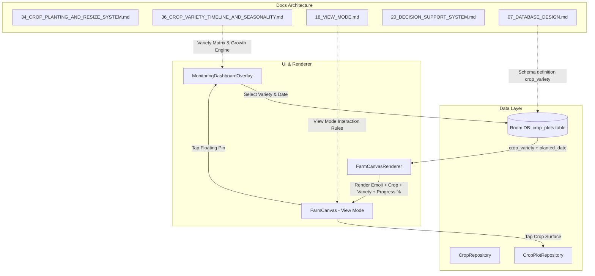

# 39. Crop View Interaction, Variety Selection & Growth Stage Simulation Specifications

> 📌 **Navigation**: [◀ 38. Audio & Sound Assets Planning](file:///d:/Development/MapTanim/docs/38_AUDIO_AND_SOUND_ASSETS_PLANNING.md) | [🏠 Master Index](file:///d:/Development/MapTanim/docs/README.md) | [40. User & Profile Schema Refinement ▶](file:///d:/Development/MapTanim/docs/40_USER_AND_PROFILE_SCHEMA_REFINEMENT.md)

---
> **Purpose**
>
> This document specifies the interactive crop selection and repositioning mechanics in **View Mode**, floating status notification pins, crop variety selection during planting initialization, growth stage simulation calculations, and home screen map label rendering rules without dimension strings.
>
> It directly extends and integrates with:
> - **[18_VIEW_MODE.md](file:///d:/Development/MapTanim/docs/18_VIEW_MODE.md)** (Home Screen Monitoring Dashboard layout & gestures)
> - **[34_CROP_PLANTING_AND_RESIZE_SYSTEM.md](file:///d:/Development/MapTanim/docs/34_CROP_PLANTING_AND_RESIZE_SYSTEM.md)** (Farm layout & canvas gestures)
> - **[36_CROP_VARIETY_TIMELINE_AND_SEASONALITY.md](file:///d:/Development/MapTanim/docs/36_CROP_VARIETY_TIMELINE_AND_SEASONALITY.md)** (Philippine crop variety matrix & stage calculator)
> - **[20_DECISION_SUPPORT_SYSTEM.md](file:///d:/Development/MapTanim/docs/20_DECISION_SUPPORT_SYSTEM.md)** (DSS alerts and automated task generation)
> - **[22_CALENDAR.md](file:///d:/Development/MapTanim/docs/22_CALENDAR.md)** (Planting schedule & timeline integration)
> - **[07_DATABASE_DESIGN.md](file:///d:/Development/MapTanim/docs/07_DATABASE_DESIGN.md)** (Room SQLite `crop_plots` and `crop_varieties` schemas)

---

# 1. View Mode Crop Selection & Repositioning Mechanics

### 1.1 Problem Statement
Previously in **[18_VIEW_MODE.md](file:///d:/Development/MapTanim/docs/18_VIEW_MODE.md)**, tapping anywhere on a crop plot while in View Mode (`CanvasMode.VIEW`) immediately opened the full-screen **Monitoring Overlay**. This prevented farmers from selecting, inspecting, dragging, or repositioning crop plots on the 2D isometric farm canvas unless they manually navigated into Edit Mode.

### 1.2 Interactive Selection & Repositioning Specification
1. **Direct Crop Selection**:
   - Tapping directly on a crop plot surface in **View Mode** executes `editViewModel.selectPlot(plotId)`.
   - The crop plot displays a clean selected bounding outline.
   - The farmer can drag the selected plot to **reposition** it across the 45m × 45m grid directly from the home screen canvas.
2. **Dedicated Floating Status & Monitoring Pins**:
   - Navigation to the Monitoring Dashboard is triggered strictly by tapping the **Floating Calendar Pin** (📅) or **Floating Task Badges** (💧 🌿 🌾 🐛) positioned cleanly on top of the crop label.
   - This separates canvas layout manipulation (clicking the crop body) from crop monitoring inspection (tapping the status pin).

```
┌─────────────────────────────────────────────────────────────┐
│                    [ 📅 Floating Pin ]                     │
│         🍅 Tomato - Diamante Max F1 • 45% (Day 27/60)       │
│           ┌─────────────────────────────────────┐           │
│           │   Direct Planted Soil Crop Bed      │           │
│           │   (Selectable & Draggable in View)  │           │
│           └─────────────────────────────────────┘           │
└─────────────────────────────────────────────────────────────┘
```

---

# 2. Crop Variety Selection Flow

When starting monitoring from the calendar, monitoring overlay, or floating pin, a **Variety Selection Modal** prompts the user to select the specific commercial cultivar from the Philippine crop variety matrix defined in **[36_CROP_VARIETY_TIMELINE_AND_SEASONALITY.md](file:///d:/Development/MapTanim/docs/36_CROP_VARIETY_TIMELINE_AND_SEASONALITY.md)**.

### 2.1 Commercial Crop Variety Registry

| Local Name | Species | Primary Commercial Varieties (From Doc 36) | Growth Duration | Optimal Season |
| :--- | :--- | :--- | :---: | :--- |
| **Sitaw** 🫘 | String Beans | *Sandigan F1*, *Galante F1*, *Bongga F1* | 48–52 Days | Year-Round / Dry |
| **Talong** 🍆 | Eggplant | *Morena F1*, *Dumaguete Long Purple*, *Casino 217* | 75–85 Days | Year-Round / Wet |
| **Kamatis** 🍅 | Tomato | *Diamante Max F1*, *Apollo*, *Cherry Tomato* | 60–72 Days | Year-Round (TyLCV Res.) |
| **Karots** 🥕 | Carrot | *Terracotta F1*, *Kuroda Improved*, *Chantenay* | 85–95 Days | Cool / Highland |
| **Sibuyas** 🧅 | Onion | *Red Pinoy F1*, *Yellow Granex*, *Super Rex* | 100–110 Days | Dry Season (Nov–Mar) |
| **Kalabasa** 🎃| Pumpkin | *Suprema F1*, *Horizon F1* | 80 Days | Year-Round |
| **Mais** 🌽 | Corn | *Machismo F1* (Sweet), *IPB Var 6* (Glutinous) | 65–72 Days | Irrigated / Wet |
| **Repolyo** 🥬| Cabbage | *K-S Cross F1*, *Kyross F1* | 60 Days | Lowland / Heat Tol. |
| **Pechay** 🥬 | Pechay | *Pavon*, *Black Beets* | 28 Days | Year-Round |
| **Ampalaya** 🥒| Bitter Gourd | *Jade Star XL F1* | 55 Days | Year-Round |
| **Okra** 🌿 | Okra | *Smooth Green* | 45 Days | Wet / Dry Season |
| **Sili** 🌶️ | Chili Pepper | *Django F1* (Siling Haba), *Taiwan Hot* | 65 Days | Year-Round |

### 2.2 Variety Selection Workflow Steps
1. Tap **"Start Monitoring"** or **"Calendar Plant to Start"** on the Monitoring Dashboard or floating pin.
2. **Variety Picker Dialog Opens**: Select the specific Variety from the dropdown list (pre-populated from `crop_varieties` or custom variety text).
3. **Planted Date Picker**: Choose the start date planted (defaults to current date ISO-8601 `LocalDate.now().toString()`).
4. **Data Persistence**:
   - The selected variety name is stored in `crop_plots.crop_variety` (Room SQLite & Supabase DTO).
   - The start date is stored in `crop_plots.planted_date`.
5. **Simulation Trigger**: The engine immediately executes `VarietyGrowthCalculator` to generate growth timeline milestones and DSS tasks.

---

# 3. Growth Stage Simulation Algorithm

Growth stage calculations adhere to the `VarietyGrowthCalculator` defined in **[36_CROP_VARIETY_TIMELINE_AND_SEASONALITY.md](file:///d:/Development/MapTanim/docs/36_CROP_VARIETY_TIMELINE_AND_SEASONALITY.md)**.

### 3.1 Mathematical Calculations

1. **Days Planted**:
   $$\text{DaysPlanted} = \text{ChronoUnit.DAYS.between}(\text{PlantedDate}, \text{Today}).\text{coerceAtLeast}(0)$$

2. **Growth Progress Ratio**:
   $$\text{ProgressPercentage} = \left( \frac{\text{DaysPlanted}}{\text{GrowthDurationDays}} \right) \times 100\% \quad (\text{bounded } 0\% - 100\%)$$

3. **Stage Breakdown**:

| Stage Index | Stage Name | Duration Ratio | Visual Renderer Asset |
| :---: | :--- | :---: | :---: |
| **1** | Sprout / Seedling | Days 1 to Stage1End | `crop_<species>_1.png` |
| **2** | Seedling / Stalk | Days Stage1End+1 to Stage2End | `crop_<species>_2.png` |
| **3** | Vegetative | Days Stage2End+1 to Stage3End | `crop_<species>_3.png` |
| **4** | Flowering / Podding | Days Stage3End+1 to Stage4End | `crop_<species>_4.png` |
| **5** | Harvest Ready | Days Stage4End+1 to DurationEnd | `crop_<species>_5.png` |

---

# 4. Home Screen Crop Label Rendering Rules

### 4.1 Strict Exclusion of Size Dimensions
Dimensions such as `(1m × 1m)` or `(2m × 3m)` are **strictly excluded** from map crop labels on the home screen to ensure clean, clutter-free HUD graphics.

### 4.2 Home Screen Label Format
```text
[Emoji] [Crop Name] - [Variety] • [Progress % or Days Status]
```

#### Render Examples:
- **Unmonitored Crop**: `🍅 Tomato - Diamante Max F1 • Pending Start`
- **Active Growth**: `🍅 Tomato - Diamante Max F1 • 45% (Day 27/60)`
- **Ready for Harvest**: `🌾 Rice - NSIC Rc 222 • 95% (Ready to Harvest)`

---

# 5. Data Flow & Architectural Connectivity



---

# 6. Database Schema Synchronization

To support crop variety persistence seamlessly across Room and Supabase:

```sql
-- SQLite migration script for crop_plots
ALTER TABLE crop_plots ADD COLUMN crop_variety TEXT DEFAULT NULL;
```

```kotlin
// Room Entity Definition Update (CropPlotEntity.kt)
@Entity(tableName = "crop_plots")
data class CropPlotEntity(
    @PrimaryKey val id: String,
    @ColumnInfo(name = "farm_id") val farmId: String,
    @ColumnInfo(name = "plot_label") val plotLabel: String,
    @ColumnInfo(name = "crop_name") val cropName: String?,
    @ColumnInfo(name = "crop_id") val cropId: String?,
    @ColumnInfo(name = "crop_variety") val cropVariety: String?,
    @ColumnInfo(name = "soil_type") val soilType: String,
    @ColumnInfo(name = "pos_x") val posX: Float,
    @ColumnInfo(name = "pos_y") val posY: Float,
    @ColumnInfo(name = "width_m") val widthM: Float,
    @ColumnInfo(name = "height_m") val heightM: Float,
    @ColumnInfo(name = "rotation_deg") val rotationDeg: Float,
    @ColumnInfo(name = "planted_date") val plantedDate: String?,
    @ColumnInfo(name = "is_active") val isActive: Boolean,
    @ColumnInfo(name = "notes") val notes: String?,
    @ColumnInfo(name = "created_at") val createdAt: String,
    @ColumnInfo(name = "updated_at") val updatedAt: String
)
```

---

## 📚 Related Documentation & Cross References
- 📄 [Master Documentation Hub](file:///d:/Development/MapTanim/docs/README.md)
- 📄 [00. Getting Started Guide](file:///d:/Development/MapTanim/docs/00_GETTING_STARTED.md)
- 📄 [03. System Architecture](file:///d:/Development/MapTanim/docs/03_SYSTEM_ARCHITECTURE.md)
- 📄 [11. App Navigation](file:///d:/Development/MapTanim/docs/11_NAVIGATION.md)
- 📄 [12. UI/UX Guidelines](file:///d:/Development/MapTanim/docs/12_UI_UX_GUIDELINES.md)
- 📄 [13. Design System](file:///d:/Development/MapTanim/docs/13_DESIGN_SYSTEM.md)
- 📄 [14. Component Library](file:///d:/Development/MapTanim/docs/14_COMPONENT_LIBRARY.md)
- 📄 [15. Render Engine](file:///d:/Development/MapTanim/docs/15_RENDER_ENGINE.md)
- 📄 [16. Interactive Plot Mapping](file:///d:/Development/MapTanim/docs/16_INTERACTIVE_PLOT_MAPPING.md)
- 📄 [18. View Mode](file:///d:/Development/MapTanim/docs/18_VIEW_MODE.md)
- 📄 [19. Edit Mode](file:///d:/Development/MapTanim/docs/19_EDIT_MODE.md)
- 📄 [34. Direct Soil Crop Planting & Resize System](file:///d:/Development/MapTanim/docs/34_CROP_PLANTING_AND_RESIZE_SYSTEM.md)
- 📄 [35. Asset Planning & Sprites](file:///d:/Development/MapTanim/docs/35_ASSETS_PLANNING.md)
- 📄 [38. Audio & Sound Assets Planning](file:///d:/Development/MapTanim/docs/38_AUDIO_AND_SOUND_ASSETS_PLANNING.md)
