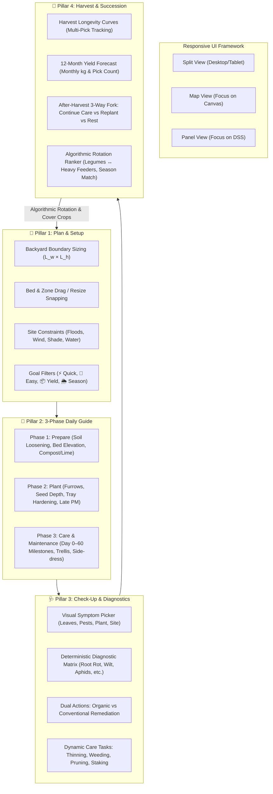

# 43. Beginner Backyard DSS & Multi-Cycle Crop Management Architecture

## 1. Executive Summary & Problem Realignment

### 1.1 The Disconnect in Previous Implementations
Previous iterations drifted into an abstract drawing canvas with fragmented tabs, static matrices, and hardcoded mock data. This failed the core target persona:
* **The Target User**: A complete beginner who wants to plant vegetables in their backyard, does not know how much will fit, when to plant, how to prepare the soil, how to care for plants daily, or what to do after the first harvest.
* **The Solution**: An integrated **Backyard Garden Layout + Daily Agro-DSS Engine** that:
  1. Sizes the user's backyard ($L_w \times L_h$ in meters) and places scalable garden beds.
  2. Subdivides beds into plant zones that dynamically calculate plant count based on published spacing standards ($sp \times rg$).
  3. Provides a daily, actionable DSS covering **Soil Preparation $\rightarrow$ Sowing/Transplanting $\rightarrow$ Day-by-Day Care & Alerts $\rightarrow$ Multi-Cycle Harvesting $\rightarrow$ Crop Succession/Rotation**.

---

## 2. Core Domain Model (Derived from Agricultural Research)

```
+---------------------------------------------------------------------------------------------------+
|                                          LAND ($L_w \times L_h$ meters)                                      |
|  +---------------------------------------------------------------------------------------------+  |
|  | Bed 1 ($x, y, w, h$ meters)                                                                  |  |
|  |  +----------------------------------+  +-------------------------------------------------+  |  |
|  |  | Zone 1: Pechay (Leafy)           |  | Zone 2: Okra (Malvaceae)                        |  |  |
|  |  | • $2.0 \times 1.2$ m -> 60 plants|  | • $2.0 \times 1.2$ m -> 12 plants               |  |  |
|  |  | • Direct seed (S), Organic       |  | • Direct seed (S), Organic                      |  |  |
|  |  | • Cut-and-come-again / single    |  | • Multi-pick over 90 days (every 2 days)        |  |  |
|  |  | • History: [cover, pechay]       |  | • History: [corn, okra]                         |  |  |
|  |  +----------------------------------+  +-------------------------------------------------+  |  |
|  +---------------------------------------------------------------------------------------------+  |
+---------------------------------------------------------------------------------------------------+
```

### 2.1 Complete Agronomic Crop Research Parameters

The agro-ecological engine models 11 Philippine backyard vegetable crops and green manures based on published Department of Agriculture (DA), Bureau of Plant Industry (BPI), and Philippine Council for Agriculture, Aquatic and Natural Resources Research and Development (PCAARRD) standards:

| Crop Key (`k`) | Name (`n`) | Icon (`e`) | Color (`c`) | Spacing (`sp`) | Row (`rg`) | Days (`d`) | Method (`m`) | Trellis (`tr`) | Prune (`pr`) | Yield (`y`) | Wet (`w`) | Dry (`dy`) | Effort (`ef`) | Feeder (`nu`) | Tray Age (`ta`) | Sun (`su`) | Family (`f`) | Interval (`p`) | Longevity (`l`) |
|---|---|---|---|---|---|---|---|---|---|---|---|---|---|---|---|---|---|---|---|
| `tomato` | Tomato | 🍅 | `#e5533d` | 50 cm | 80 cm | 75 d | `T` | 1 | 1 | 2.0 kg | 0 (Risky) | 2 (Optimal) | 3 | 3 (Heavy) | 25 d | `f` | `sol` | 3 d | 45 d |
| `eggplant` | Eggplant | 🍆 | `#8a5db0` | 60 cm | 80 cm | 85 d | `T` | 0 | 0 | 1.5 kg | 2 (Good) | 2 (Optimal) | 2 | 3 (Heavy) | 30 d | `f` | `sol` | 4 d | 90 d |
| `chili` | Chili pepper | 🌶️ | `#d9382c` | 40 cm | 60 cm | 85 d | `T` | 0 | 0 | 0.5 kg | 1 (Mod) | 2 (Optimal) | 1 | 2 (Med) | 30 d | `f` | `sol` | 6 d | 150 d |
| `okra` | Okra | 🫛 | `#5f9e3f` | 30 cm | 60 cm | 55 d | `S` | 0 | 0 | 0.8 kg | 2 (Good) | 2 (Optimal) | 1 | 2 (Med) | 0 d | `f` | `mal` | 2 d | 90 d |
| `pechay` | Pechay | 🥬 | `#2f9e58` | 20 cm | 25 cm | 30 d | `S` | 0 | 0 | 0.15 kg | 1 (Mod) | 2 (Optimal) | 1 | 2 (Med) | 0 d | `p` | `bra` | 0 d | 0 d |
| `lettuce` | Lettuce | 🥗 | `#7cbf55` | 25 cm | 30 cm | 45 d | `T` | 0 | 0 | 0.20 kg | 0 (Risky) | 2 (Optimal) | 2 | 2 (Med) | 21 d | `p` | `ast` | 0 d | 0 d |
| `kangkong` | Kangkong | 🌿 | `#1f8a55` | 15 cm | 25 cm | 28 d | `B` | 0 | 0 | 0.20 kg | 2 (Good) | 1 (Mod) | 1 | 2 (Med) | 0 d | `p` | `con` | 12 d | 120 d |
| `cucumber` | Cucumber | 🥒 | `#4a9a3a` | 40 cm | 100 cm | 50 d | `S` | 1 | 0 | 1.5 kg | 1 (Mod) | 2 (Optimal) | 2 | 2 (Med) | 0 d | `f` | `cuc` | 2 d | 30 d |
| `sitaw` | Yardlong bean | 🫘 | `#8aa832` | 25 cm | 60 cm | 55 d | `S` | 1 | 0 | 0.6 kg | 2 (Good) | 1 (Mod) | 1 | 1 (Light) | 0 d | `f` | `leg` | 3 d | 40 d |
| `corn` | Sweet corn | 🌽 | `#d9a514` | 25 cm | 70 cm | 75 d | `S` | 0 | 0 | 0.4 kg | 2 (Good) | 2 (Optimal) | 2 | 3 (Heavy) | 0 d | `f` | `poa` | 0 d | 0 d |
| `cover` | Cover crop (Mungbean) | 🌱 | `#9bbf6a` | 10 cm | 20 cm | 45 d | `S` | 0 | 0 | 0.0 kg | 2 (Good) | 2 (Optimal) | 1 | 1 (Light) | 0 d | `f` | `cov` | 0 d | 0 d |

#### Parameter Definitions:
* **`sp` (Spacing in Row)** & **`rg` (Row Spacing)**: Centimeters between plants and rows. Used to dynamically compute plant capacity from zone size ($w \times h$).
* **`d` (Days to First Harvest)**: Base maturity period from direct seeding or transplanting to first harvest.
* **`m` (Planting Method)**: `S` = Direct Seeding, `T` = Tray-nursed Transplant, `B` = Broadcast / Stem Cuttings.
* **`tr` (Trellis)** & **`pr` (Pruning)**: Mechanical support and vegetative sucker removal requirements.
* **`y` (Yield)**: Average harvested yield per plant ($kg$) under standard care.
* **`w` & `dy`**: Agronomic seasonal tolerance score: `0` = High risk, `1` = Moderate / manageable, `2` = Optimal fit.
* **`ef` (Effort)**: Care complexity: `1` = Beginner-friendly / low maintenance, `2` = Moderate, `3` = High attention.
* **`nu` (Nutrient Feeder Category)**: `1` = Nitrogen-fixing legume or light feeder, `2` = Moderate feeder, `3` = Heavy feeder.
* **`su` (Sunlight)**: `f` = Full Sun ($6+$ hours direct light), `p` = Partial Shade tolerant ($4\text{--}5$ hours).
* **`f` (Botanical Family)**: Used by the rotation engine to prevent shared disease transmission:
  * `sol` = Solanaceae (Nightshades)
  * `bra` = Brassicaceae (Crucifers)
  * `con` = Convolvulaceae (Morning Glory)
  * `cuc` = Cucurbitaceae (Cucurbits / Gourds)
  * `leg` = Fabaceae (Legumes)
  * `mal` = Malvaceae (Mallows)
  * `ast` = Asteraceae (Composites)
  * `poa` = Poaceae (Grasses / Cereals)
  * `cov` = Cover Crop / Green Manure
* **`p` (Picking Interval)**: Number of days between consecutive pickings ($p > 0$ for multi-harvest crops; $0$ for single-cut).
* **`l` (Harvest Longevity Window)**: Number of days the crop continues producing marketable yield after the initial harvest date before bed exhaustion.

---

### 2.2 Cultivar & Variety Modifiers (`VAR`)

Varieties alter standard crop agronomics. When a beginner selects a specific variety, the engine adjusts days to maturity, picking longevity, physical spacing, and seasonal resilience:

| Crop | Variety Name | Agronomic Alterations | Practical Guidance |
|---|---|---|---|
| **Tomato** | Standard | Baseline profile ($d=75, l=45, tr=1, pr=1$) | General-purpose all-round tomato. |
| | Bush (determinate) | $\Delta d = -8\text{d}, \Delta l = -20\text{d}, tr = 0, pr = 0, y = 0.8\times, \Delta sp = -10\text{cm}, \Delta rg = -10\text{cm}$ | Compact plant: stake only, no pruning; fruits ripen over a short concentrated window. Ideal for small backyards. |
| | Vining (indeterminate) | $\Delta d = +5\text{d}, \Delta l = +30\text{d}, tr = 1, pr = 1, y = 1.3\times$ | Grows tall: requires sturdy $1.8\text{m}$ trellis and weekly suckering, but harvests continuously over $2.5+$ months. |
| | Heat/rain-tolerant hybrid | $w = 1, y = 1.1\times$ | Tolerates high heat, heavy rains, and bacterial wilt; requires raised bed ($25\text{--}30\text{ cm}$) and good drainage. |
| **Eggplant** | Standard | Baseline ($d=85, l=90$) | Classic purple long eggplant. |
| | Early hybrid | $\Delta d = -10\text{d}, y = 1.15\times$ | Fruits earlier and heavier; requires consistent bi-weekly feeding. |
| | Rain-tolerant type | $w = 1$ | Better root survival during Philippine monsoon; requires high raised bed. |
| **Chili** | Standard | Baseline ($d=85, l=150$) | Standard bell or finger pepper. |
| | Small hot type (Siling Labuyo) | $\Delta d = +10\text{d}, \Delta l = +60\text{d}, y = 0.6\times$ | Extremely hardy and perennial in Philippine backyards; yields continuously for $7+$ months. |
| | Large mild type | $\Delta d = -5\text{d}, y = 1.3\times, \Delta sp = +10\text{cm}$ | Plump sweet bell pepper; needs consistent watering and extra calcium. |
| **Okra** | Dwarf type | $\Delta d = -5\text{d}, y = 0.8\times, \Delta sp = -10\text{cm}$ | Shorter plant ($1\text{m}$ max), easier to harvest in compact backyards. |
| **Pechay** | Heat-tolerant type | $w = 1$ | Bolts and burns less under tropical heat and sudden rains. |
| **Lettuce** | Loose-leaf / heat-tolerant | $w = 1, \Delta d = -5\text{d}$ | Pick outer leaves as needed (cut-and-come-again); tolerates heat better than heading types. |
| **Kangkong** | Upland type | Baseline ($d=28, l=120, p=12$) | Thrives in garden soil with regular watering; cut stems $5\text{ cm}$ above base every 2 weeks. |
| **Cucumber** | Bush type | $tr = 0, y = 0.7\times, \Delta rg = -40\text{cm}$ | Compact trailing vines; no tall trellis required. |
| **Sitaw** | Bush type | $tr = 0, \Delta d = -10\text{d}, y = 0.7\times$ | Self-supporting bush sitaw; earlier harvest, no pole construction needed. |
| **Sweet Corn** | Early sweet type | $\Delta d = -10\text{d}, y = 0.9\times$ | Fast maturity; pick at milk stage within $2\text{--}3$ days of silk browning. |

---

### 2.3 Physical Plant Capacity Math

Beginners must not guess plant counts. Given plant zone dimensions ($w \times h$ in meters) and crop spacing ($sp \times rg$ in cm):

$$\text{Dimension}_1 = \max(w, h) \times 100 \text{ cm}$$

$$\text{Dimension}_2 = \min(w, h) \times 100 \text{ cm}$$

$$\text{Plants In Row} = \max\left(1, \left\lfloor \frac{\text{Dimension}_1}{sp} \right\rfloor\right)$$

$$\text{Number of Rows} = \max\left(1, \left\lfloor \frac{\text{Dimension}_2}{rg} \right\rfloor\right)$$

$$\text{Total Plants} = \text{Plants In Row} \times \text{Number of Rows}$$

*Example: A $2.0\text{m} \times 1.2\text{m}$ bed section:*
* For Pechay ($sp=20\text{cm}, rg=25\text{cm}$): $\lfloor 200/20 \rfloor \times \lfloor 120/25 \rfloor = 10 \times 4 = \mathbf{40\text{ plants}}$.
* For Tomato ($sp=50\text{cm}, rg=80\text{cm}$): $\lfloor 200/50 \rfloor \times \lfloor 120/80 \rfloor = 4 \times 1 = \mathbf{4\text{ plants}}$.

---

### 2.4 Real-World Visual Scale Benchmark (`BasketballCourtScaleCard`)
Abstract numbers like "$2.4\text{ m}^2$" or "$15\text{ m}^2$" are difficult for complete beginners to mentally visualize. In the Philippine context, the standard **Barangay / FIBA Basketball Court ($28\text{m} \times 15\text{m} = 420\text{ m}^2$)** serves as the universal physical benchmark:
* **Visual Court Canvas**: A proportional 2D court layout rendering the court boundary, half-court line, and center circle.
* **Proportional Bed Overlay**: The user's bed or backyard zone is drawn directly inside the court outline to scale:
  $$\text{Court Percentage} = \frac{\text{Bed Area } (\text{m}^2)}{420\text{ m}^2} \times 100\%$$
* **Intuitive Descriptions**:
  * $<1\%$: *"About 0.5% of a full barangay basketball court."*
  * $5\text{--}15\%$: *"Takes up about 10% of a court (compact backyard patch)."*
  * $25\text{--}50\%$: *"Takes up roughly half-court."*
This gives the beginner an instant, grounded sense of physical scale before breaking ground in their yard.

---

## 3. The 4-Pillar Decision Support System (DSS)



---

### Pillar 1: 🌱 Plan & Setup

#### 1. Backyard Bounding & Geometry:
* Backyard dimensions ($L_w \times L_h$) range from $4\text{m} \times 3\text{m}$ to $40\text{m} \times 30\text{m}$.
* Scale factor: $S = \text{clamp}(\text{viewportWidth} / L_w, 20, 60)\text{ dp/m}$.
* Coordinate snapping: $sn(v) = \text{round}(v \times 10) / 10$ ($0.1\text{m}$ grid snap).
* Boundary clamping:
  $$0 \le b.x \le L_w - b.w, \quad 0 \le b.y \le L_h - b.h$$
  $$0 \le z.x \le b.w - z.w, \quad 0 \le z.y \le b.h - z.h$$

#### 2. Site Constraint Flags:
* `fl` (**Floods / Poor Drainage**): Requires raised beds ($25\text{--}30\text{ cm}$) and peripheral drainage ditches.
* `wi` (**Windy Site**): Requires windbreak planting (vetiver, napier grass, banana) and sturdy staking for tall/trellised crops (`tr == 1` or corn).
* `sh` (**Shady Site < 5 hrs direct sun**): Disallows full-sun crops (`su == 'f'`); suggests shade-tolerant pechay, lettuce, or kangkong.
* `nw` (**Water Scarcity / Hard to Water**): Demands $5\text{ cm}$ rice-straw mulching or bottle/drip irrigation; recommends drought-tolerant okra, eggplant, or chili.

#### 3. Companion Planting Matrix (`CP`):
The DSS dynamically checks neighbors within the same bed:
* **Careful Neighbors (Warning `a`)**:
  * `sol` + `sol`: Both share bacterial wilt (*Ralstonia solanacearum*), whiteflies, and fruit borers. Maintain $1\text{m}$ separation and never repeat on the same soil next cycle.
  * `poa` + `sol`: Both attract the same corn earworm / tomato fruit borer (*Helicoverpa armigera*). Plant marigold or basil barriers between them.
  * `cuc` + `sol`: Both share whiteflies and fungal blights. Keep leaves dry and provide $1\text{m}$ buffer.
* **Good Neighbors (Synergy `g`)**:
  * `leg` + `poa`: Beans fix atmospheric nitrogen and can climb corn stalks. Sow beans 2 weeks after corn, 15 cm from base.
  * Leafy (`bra`, `ast`, `con`) + `sol`: Leafy greens benefit from partial noon shade cast by tall tomatoes/eggplants.
  * Leafy (`bra`, `ast`, `con`) + `mal`: Leafy crops enjoy light dappled shade on the eastern side of okra.
  * `leg` + `sol`: Legumes enrich soil nitrogen for heavy-feeding solanaceous crops.

---

### Pillar 2: 📖 3-Phase Daily Step-by-Step Guide

```
+---------------------------------------------------------------------------------------------------+
| 📖 GUIDE: Pechay (Direct Seed · Organic · Day 12 · Dry Season)                                     |
|                                                                                                   |
| [▶] 1 · Prepare Soil                                                                              |
|     • Sun: 4–5 hours is enough; tolerates light noon shade.                                       |
|     • Clear weeds and loosen soil 25–30 cm. Shape a shallow water-retaining basin.                |
|     • Mix 3 kg/m² compost or vermicast into the top 15 cm of soil.                                |
|     • If soil pH < 5.5, apply 100 g/m² agricultural lime 1 week prior.                            |
|     • Mark spacing: 20 cm in row × 25 cm between rows (40 plants in this zone).                   |
|                                                                                                   |
| [▼] 2 · Plant (Direct Seeding)                                                                    |
|     • Sow a pinch of seeds along each shallow furrow (0.5–1 cm deep); water gently with fine rose.|
|     • Thin to 1 strong plant per spot at 2 true leaves (Day 10–14). Eat the thinnings!            |
|     • Cover lightly with rice-straw mulch; keep moist until germination.                          |
|                                                                                                   |
| [▼] 3 · Care & Maintenance                                                                        |
|     Day 0–7:   Keep soil consistently moist. Replant gaps where seeds failed to sprout.           |
|     Day 7–14:  First weeding and light mulch. Inspect undersides of leaves for flea beetles. ← NOW|
|     Day 21–28: Side-dress: ring of vermicast + diluted fermented plant juice (FPJ 1:1000).        |
|     Day 30+:   Harvest window — cut outer leaves or harvest whole head; re-sow new batch!         |
+---------------------------------------------------------------------------------------------------+
```

#### Soil Dosing Rules:
* **Organic**: $\text{Compost} = [0, 2, 3, 5][nu]\text{ kg}/\text{m}^2$. Heavy feeders (`nu == 3`, e.g., Tomato, Corn) receive $5\text{ kg}/\text{m}^2$ vermicast/compost.
* **Conventional**: $2\text{ kg}/\text{m}^2\text{ compost} + [0, 10, 25, 40][nu]\text{ g}/\text{m}^2$ complete fertilizer (14-14-14).

---

### Pillar 3: 🩺 Check-Up & Symptom Diagnostics Engine

Beginners tap observed symptoms across 4 categories:

#### Symptom Taxonomy (`SY`):
1. **Leaves**:
   * `yl` = Older lower leaves turning yellow
   * `yn` = New leaves pale yellow, veins remain green (interveinal chlorosis)
   * `sp` = Brown or black spots on foliage
   * `cu` = Leaves curling, cupping, or twisting
   * `wl` = Daytime wilting despite moist soil
   * `ho` = Holes or chewed ragged leaf margins
   * `pw` = White powdery coating on leaf surface
2. **Pests**:
   * `ap` = Tiny clustered soft insects / sticky honeydew
   * `wf` = Tiny white moth-like flies fluttering when shaken
   * `ca` = Caterpillars or dark frass pellets present
   * `fb` = Entry holes or internal rotting inside fruits/pods
3. **Plant**:
   * `lg` = Leggy, tall, weak stems falling over
   * `nf` = Luxurious foliage but no flowers or fruit set
   * `fd` = Flower blossoms yellowing and dropping off
   * `be` = Dark, sunken, leathery spot at blossom end of fruit
4. **Site / Environment**:
   * `wt` = Soil waterlogged / standing puddle
   * `dr` = Soil dry, cracked, pulling away from bed edges
   * `wd` = Heavy weed invasion
   * `cw` = Plants touching, overcrowded
   * `sh` = Excessive shade (<5 hours direct sun)

#### Diagnostic Inference Rules (`DX`):

| Condition / Cause | Must-Have Symptoms | Any-Of Symptoms | Must-Not Symptoms | Organic Prescription | Conventional Prescription |
|---|---|---|---|---|---|
| **Waterlogged Roots / Root Rot** | `wt` | `yl`, `wl` | — | Stop watering immediately; loosen soil perimeter; raise bed $25\text{ cm}$; dig exit drain; drench soil with *Trichoderma harzianum*. | Improve drainage; apply labeled fungicide for root rot (e.g., metalaxyl or fosetyl-Al) as per label directions. |
| **Severe Underwatering** | `dr` | `wl`, `yl`, `cu` | — | Water deeply in early morning; apply $5\text{ cm}$ rice straw or dried leaf mulch; set up recycled bottle drip. | Deep drip irrigation; mulch heavily; avoid shallow mid-day sprinkling. |
| **Nitrogen Deficiency** | `yl` | — | `wt`, `dr` | Side-dress $1\text{ kg}/\text{m}^2$ vermicast; foliar spray diluted Fermented Plant Juice (FPJ) or compost tea weekly. | Side-dress $10\text{ g}$ urea (46-0-0) or complete fertilizer (14-14-14) per plant, placed $10\text{ cm}$ from stem, followed by watering. |
| **Iron Deficiency / Alkaline pH** | `yn` | — | — | Incorporate rich compost and peat/coir mulch; avoid excess wood ash or agricultural lime; verify pH ($6.0\text{--}6.8$ target). | Apply foliar chelated iron (Fe-EDDHA / Fe-EDTA) spray per label; correct soil alkalinity with sulfur. |
| **Bacterial Wilt (*Ralstonia*)** | `wl` | — | `wt`, `dr` | No chemical cure. Immediately uproot and bag wilted plants; do not compost. Rotate bed to non-solanaceous crops for 2 seasons. | No chemical cure. Remove and sanitize; rotate bed away from tomato, eggplant, and chili for at least 2 full cycles. |
| **Aphid Infestation** | `ap` | — | — | Spray soapy water ($1\text{ tbsp}$ mild soap / $1\text{L}$ water) or cold-pressed neem oil ($5\text{ mL}/\text{L}$) at dusk; conserve ladybugs. | Apply labeled insecticide for sucking pests (e.g., imidacloprid or deltamethrin); respect strict pre-harvest interval (PHI). |
| **Whiteflies / Leaf-Curl Virus** | `wf` | `cu`, `yl` | — | Install yellow sticky cards at canopy level; spray neem extract weekly; immediately rogue out stunted virus-infected plants. | Apply labeled insecticide for whiteflies; remove virus-infected plants immediately (viral vectors cannot be cured post-infection). |
| **Leaf-Eating Caterpillars** | — | `ca`, `ho` | — | Handpick larvae at twilight; spray *Bacillus thuringiensis* (Bt) or chili-garlic extract on leaf undersides. | Apply Bt or labeled insecticide (e.g., chlorantraniliprole); spray in late afternoon to protect pollinators. |
| **Fruit / Pod Borer** | `fb` | — | — | Pick and bag damaged fruits daily; deploy pheromone delta traps; apply neem or Bt spray post-fruit set. | Collect and destroy bored fruit; apply labeled insecticide immediately following petal fall; adhere to PHI. |
| **Fungal Leaf Spot / Blight** | `sp` | — | — | Prune and destroy lower diseased leaves; avoid overhead watering; spray copper octanoate or baking soda solution. | Apply labeled copper fungicide or mancozeb; increase plant spacing to maximize air circulation. |
| **Powdery Mildew** | `pw` | — | — | Spray $1\text{ part}$ cow milk to $9\text{ parts}$ water in morning sun; thin overcrowded canopy foliage. | Apply wettable sulfur or labeled systemic fungicide (e.g., azoxystrobin); thin dense foliage. |
| **Blossom-End Rot** | `be` | — | — | Maintain uniform soil moisture; apply $5\text{ cm}$ mulch; incorporate finely crushed eggshells or dolomite lime into bed. | Maintain steady irrigation schedule; apply foliar calcium nitrate ($Ca(NO_3)_2$) spray per label. |
| **Excessive Nitrogen / Shade** | `nf` | `lg`, `sh` | — | Prune overhead shade branches; stop high-nitrogen manures; apply wood ash (potassium) or rock phosphate. | Stop nitrogen fertilization; apply high potassium-phosphorus fertilizer (e.g., 0-20-20 or 0-0-60). |
| **Heat & Transpiration Stress** | `fd` | — | — | Erect $30\text{--}50\%$ shade netting over bed during $11\text{AM}\text{--}2\text{PM}$; maintain soil mulch; avoid nitrogen feeding. | Provide temporary midday shade cloth; ensure consistent morning drip irrigation. |

---

### Pillar 4: 📅 Harvest & Multi-Cycle Crop Succession

#### 1. Multi-Harvest Picking Dynamics
Real backyard agriculture distinguishes single-cut crops from continuous flush producers:
* **Single-Cut Harvest ($p = 0$)**: Pechay, Lettuce, Sweet Corn, Cover Crop. The entire plant is harvested at day $d$. The bed zone is then ready for the "What Next?" fork.
* **Continuous Multi-Pick ($p > 0$)**: Tomato, Eggplant, Chili, Okra, Cucumber, Sitaw, Kangkong.
  * First pick occurs at day $d$.
  * Subsequent picks repeat every $p$ days throughout the productive longevity window $l$:
    $$\text{Picks Count} = \left\lfloor \frac{l}{p} \right\rfloor + 1$$
  * Yield per pick:
    $$\text{Yield per Pick} = \frac{\text{Total Plants} \times y}{\text{Picks Count}}$$

*Example: 10 Eggplant plants ($y = 1.5\text{ kg}$, $d = 85$, $p = 4$, $l = 90$):*
* Longevity = $90$ days. Picking occurs every $4$ days $\rightarrow \lfloor 90/4 \rfloor + 1 = \mathbf{23\text{ harvest picks}}$.
* Total yield = $10 \times 1.5 = 15\text{ kg}$, yielding $\approx 0.65\text{ kg}$ fresh eggplants every 4 days.

#### 2. The "What Next?" Post-Harvest 3-Way Fork
When a zone approaches or completes its first harvest ($a \ge d - 7$), the DSS guides the beginner with 3 clear options:

```
[Option A: ★ Continue Care (Keep Harvesting)]
- Condition: Crop has p > 0, age a < d + l, and no systemic wilt/virus reported in Check-up.
- Guidance: "Eggplant gives ~23 picks (every 4 days). Prune yellowing lower leaves, side-dress 
  compost every 3 weeks, and inspect weekly for fruit borers."

[Option B: Replant New Seeds / Seedlings]
- Condition: Single harvest completed, or multi-pick crop has reached end of longevity window.
- Guidance: "Clear residues, mix 2 kg/m² compost into the soil, and plant a different family around 
  Nov 15. Relay tip: start seedlings in nursery trays 2–3 weeks before bed clearance."

[Option C: Rest & Rebuild the Soil]
- Condition: Mandatory if family repeated in history or soil-borne disease reported; optional otherwise.
- Guidance: "A disease sign was reported or solanaceous crops were grown here previously. Sow a 
  30–45 day green manure cover crop (mungbean / cowpea) and incorporate into soil, or solarize under 
  clear plastic sheeting for 4–6 weeks."
```

#### 3. Algorithmic Succession & Rotation Scoring Formula
When replanting, the engine filters all available crops (excluding the current crop's family and the last 2 families in `hist`), scoring candidates for the target date ($nd$):

$$\text{SeasonScore} = \text{fit}(c, nd) \times 10 \quad (\text{Optimal}=20, \text{Mod}=10, \text{Risky}=0)$$

$$\text{FeederScore} = \begin{cases}
+8 & \text{if previous crop was heavy feeder } (nu=3) \text{ and candidate is legume } (f=\text{'leg'}) \\
+4 & \text{if previous crop was legume } (f=\text{'leg'}) \text{ and candidate is heavy feeder } (nu=3) \\
+3 & \text{if previous crop was heavy feeder } (nu=3) \text{ and candidate is moderate } (nu=2) \\
0 & \text{otherwise}
\end{cases}$$

$$\text{DurationPenalty} = \frac{c.d}{20}$$

$$\text{Total Score} = \text{SeasonScore} + \text{FeederScore} - \text{DurationPenalty}$$

*Generated Plain-Language Explanations:*
* *"Fits the dry season · Legume restores nitrogen depleted by previous heavy-feeding tomato."*
* *"Fits the wet season · New botanical family breaks shared soil fungal blights."*

---

## 4. Technical Architecture & Jetpack Compose Blueprint

### 4.1 UI Layout Topology
The mobile app renders a unified, responsive 3-mode interface (`BackyardGardenScreen.kt`):
* **Mode 0 (`Split`)**: Side-by-side: 2D interactive canvas on left ($55\%$), 4-pillar DSS panel on right ($45\%$).
* **Mode 1 (`Map`)**: Fullscreen 2D canvas with floating HUD controls.
* **Mode 2 (`Panel`)**: Fullscreen DSS management tab view.

### 4.2 State Representation (`BackyardGardenUiState.kt`)
```kotlin
data class BackyardGardenUiState(
    val landWidthM: Float = 12f,
    val landHeightM: Float = 8f,
    val beds: List<GardenBed> = emptyList(),
    val selectedBedId: Long? = null,
    val selectedZoneId: Long? = null,
    val activeTab: DssTab = DssTab.PLAN, // PLAN, GUIDE, CHECKUP, HARVEST
    val activeLayer: CanvasLayer = CanvasLayer.CROPS, // CROPS, RISK, HARVEST
    val siteConstraints: Set<SiteConstraint> = emptySet(),
    val activeGoal: BeginnerGoal? = null,
    val reportedSymptoms: Set<String> = emptySet(),
    val isWetSeason: Boolean = false,
    val isLoading: Boolean = false
)
```

### 4.3 Room Database Schema & Entities

```kotlin
@Entity(tableName = "backyard_beds")
data class BedEntity(
    @PrimaryKey(autoGenerate = true) val id: Long = 0,
    @ColumnInfo(name = "name") val name: String,
    @ColumnInfo(name = "x") val x: Float,
    @ColumnInfo(name = "y") val y: Float,
    @ColumnInfo(name = "width_m") val widthM: Float,
    @ColumnInfo(name = "height_m") val heightM: Float
)

@Entity(
    tableName = "backyard_plant_zones",
    foreignKeys = [
        ForeignKey(
            entity = BedEntity::class,
            parentColumns = ["id"],
            childColumns = ["bed_id"],
            onDelete = ForeignKey.CASCADE
        )
    ],
    indices = [Index("bed_id")]
)
data class PlantZoneEntity(
    @PrimaryKey(autoGenerate = true) val id: Long = 0,
    @ColumnInfo(name = "bed_id") val bedId: Long,
    @ColumnInfo(name = "crop_key") val cropKey: String,
    @ColumnInfo(name = "x") val x: Float,
    @ColumnInfo(name = "y") val y: Float,
    @ColumnInfo(name = "width_m") val widthM: Float,
    @ColumnInfo(name = "height_m") val heightM: Float,
    @ColumnInfo(name = "planting_method") val method: String, // "S", "T", "B"
    @ColumnInfo(name = "is_organic") val isOrganic: Boolean,
    @ColumnInfo(name = "variety_index") val varietyIndex: Int,
    @ColumnInfo(name = "planted_date") val plantedDate: String, // YYYY-MM-DD
    @ColumnInfo(name = "crop_history_json") val historyJson: String // ["cover", "tomato"]
)
```

---

## 5. Verification & Acceptance Criteria

1. **Backyard Sizing & Capacity Verification**:
   * Changing land dimensions from $12\text{m} \times 8\text{m}$ to $6\text{m} \times 4\text{m}$ automatically clamps existing beds to the new perimeter without data corruption.
   * Creating a $3.0\text{m} \times 1.2\text{m}$ bed and assigning Pechay ($20\text{cm} \times 25\text{cm}$) calculates $\lfloor 300/20 \rfloor \times \lfloor 120/25 \rfloor = 15 \times 4 = \mathbf{60\text{ plants}}$.
2. **Seasonality Risk Alerting**:
   * Sowing Tomato in July (Philippine wet season) triggers an immediate high-risk banner with raised-bed ($25\text{--}30\text{ cm}$) and drainage ditch instructions.
3. **Diagnostic Engine Accuracy**:
   * Checking `wt` (waterlogged) + `yl` (yellowing lower leaves) + `wl` (wilting) immediately outputs *Waterlogged Roots / Root Rot* as Diagnosis #1 with dual organic (*Trichoderma*) and conventional recommendations.
4. **Multi-Cycle Longevity Tracking**:
   * Eggplant harvested on Day 85 schedules pick #2 on Day 89 and displays progress across its 90-day window.
5. **Algorithmic Succession Verification**:
   * Completing Tomato triggers Sitaw (Yardlong Bean) as the top recommendation with plain-language explanation: *"Legume restores nitrogen depleted by previous heavy-feeding tomato"*.
6. **Zero Static Mock Data**:
   * All tasks, recommendations, and bed geometries persist in the Room SQLite database and sync with Supabase. No hardcoded mock lists exist in production builds.
