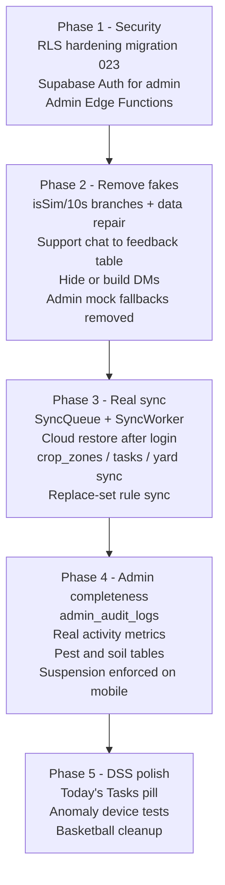

# 45 — Production Readiness Gap Analysis (Mock Data · Supabase · Admin · DSS)

> **Status:** Audit only — no code was changed to produce this document.
> **Audited branch:** `feature/vegplotter` @ `3ba51d3`
> **Audit date:** 2026-10-05
> **Scope:** `mobile/`, `backend/`, `admin/`, `database/`

This document lists **every place where MapTanim is still using mock data, fake behavior, or incomplete Supabase wiring**, plus the remaining DSS refinement tasks. Each item has a severity, the exact file location, what is wrong, and what "complete" means.

---

## 0. Severity Legend

| Level | Meaning |
|---|---|
| 🔴 **P0 – Critical** | Security hole or data loss. Must fix before any real farmer uses the app. |
| 🟠 **P1 – High** | Feature looks like it works but is fake / does not reach the database. |
| 🟡 **P2 – Medium** | Works partially; wrong numbers, stale data, or drift between systems. |
| 🟢 **P3 – Low** | Cleanup, naming, legacy code, UX polish. |

---

## 1. Executive Summary

| Area | Verdict | Main Problem |
|---|---|---|
| **Security / RLS** | 🔴 Not production-safe | Almost every table is `USING (true)` — anyone with the public anon key can read/edit/delete all data. |
| **Admin authentication** | 🔴 Not production-safe | Login is checked in the browser against `VITE_` env vars (shipped inside the JS bundle) with a hardcoded fallback password. |
| **Admin data layer** | 🟠 Half mock | `api.ts` seeds itself from `mockData.ts` and silently falls back to mock data on any error or empty table. Write errors are swallowed. |
| **Admin audit logs** | 🟠 Fully fake | Logs live only in browser memory with a hardcoded IP and email. |
| **Mobile offline sync** | 🟠 Not implemented | `SyncQueue` table exists, but nothing enqueues or drains it. No `SyncWorker` exists. Failed writes are lost. |
| **Mobile cloud restore** | 🟠 Not implemented | `fetchFromRemote()` for farms, plots, tasks is never called. Reinstall = data gone from the phone. |
| **Mobile mock leftovers** | 🟠 Present in production UI | "10s Simulation Test" varieties, Ampalaya counted in **seconds**, fake support tickets, fake demo bed. |
| **Edge Functions** | 🟡 Written, unused | `evaluate-dss`, `broadcast-dispatcher`, `sync-profile` are not called by mobile or admin. |
| **Schema** | 🟡 Drift | `crop_logs`, `dss_decisions`, `dss_evaluations` only exist in a loose SQL file, not in versioned migrations. `crop_zones`/`farm_objects` never sync. |
| **DSS refinement** | 🟢 Planned | Today's Tasks always on top; legacy basketball benchmark files still present. |

---

## 2. 🔴 P0 — Security Problems (fix first)

### 2.1 Row Level Security is effectively OFF

RLS is "enabled" but the policies allow everyone to do everything. The anon key is public by design (it is inside the APK and the admin bundle), so these policies mean **any person on the internet can read, change, or delete every farmer's data**.

| Table | Policy | File |
|---|---|---|
| `farms` | SELECT / INSERT / UPDATE / DELETE `USING (true)` | [012_align_schema_with_codebase.sql](../database/migration/012_align_schema_with_codebase.sql) |
| `crop_plots`, `crop_zones`, `farm_objects` | `FOR ALL USING (true) WITH CHECK (true)` | 012 |
| `harvest_records`, `feedback`, `notifications` | `FOR ALL USING (true)` | 012, 020 |
| `crops` | `crops_all FOR ALL USING (true)` — anyone can delete the crop catalog | [015_crop_uploader_dynamic_sync.sql](../database/migration/015_crop_uploader_dynamic_sync.sql) |
| `dss_rules` | `dss_rules_all` — anyone can rewrite DSS companion rules | [014_dss_rules_and_kb_sync.sql](../database/migration/014_dss_rules_and_kb_sync.sql) |
| `users` | `users_read_all FOR SELECT USING (true)` — **all emails are public** | [005_admin_read_policies_and_user_tracking.sql](../database/migration/005_admin_read_policies_and_user_tracking.sql) |
| `community_posts`, `community_comments` | UPDATE / DELETE `USING (true)` — anyone can delete anyone's post | [008_community_hub.sql](../database/migration/008_community_hub.sql) |
| `community_reports` | UPDATE / DELETE `USING (true)` | [009_community_reports.sql](../database/migration/009_community_reports.sql) |
| `crop_rotation_log` | `FOR ALL USING (true)` | [021_badge_rotation_and_practical_agronomy.sql](../database/migration/021_badge_rotation_and_practical_agronomy.sql) |
| `crop_logs`, `dss_evaluations`, `dss_decisions` | `FOR ALL USING (true)` | [dss_migration.sql](../database/sql/dss_migration.sql) |
| Storage bucket `crop-images` | Public **upload / update / delete** | [017_setup_supabase_storage_bucket.sql](../database/migration/017_setup_supabase_storage_bucket.sql) |

> [!NOTE]
> Migration 008 also has duplicate `CREATE POLICY` lines after each `DROP POLICY`, so re-running it fails with "policy already exists".

**What "complete" looks like:**
1. Add an `is_admin()` SQL helper (reads `users.role` for `auth.uid()`, `SECURITY DEFINER`).
2. Farmer tables (`farms`, `crop_plots`, `crop_zones`, `farm_objects`, `harvest_records`, `crop_logs`, `tasks`, `crop_rotation_log`): owner-only — `farmer_id = auth.uid()` or owned through `farms.farmer_id`. Admin: SELECT through `is_admin()`.
3. Reference tables (`crops`, `dss_rules`, `crop_profiles`): SELECT for everyone. INSERT/UPDATE/DELETE only `is_admin()`.
4. `users`: a farmer can SELECT only their own row. Admin can SELECT all. `role` and `status` can only be changed by admin.
5. `community_*`: SELECT all. INSERT with `author_id = auth.uid()`. UPDATE/DELETE by author or `is_admin()`.
6. `notifications`: a farmer reads `user_id = auth.uid() OR user_id IS NULL`. Only admin or the service role can insert.
7. `crop-images` bucket: public read; write only `is_admin()`.
8. Put all of this in one new versioned migration (`023_production_rls_hardening.sql`), and remove the duplicates from 008.

### 2.2 Admin login is fake security

File: [AuthContext.tsx](../admin/src/context/AuthContext.tsx)

| Problem | Why it matters |
|---|---|
| Credentials are `VITE_ADMIN_EMAIL` / `VITE_ADMIN_PASSWORD` / `VITE_ADMIN_ACCOUNTS`. | Every `VITE_*` variable is **compiled into the public JS bundle**. Anyone can open DevTools and read the admin password. |
| Hardcoded fallback `admin@maptanim.com` / `admin123456` when env is missing. | Default credentials in production. |
| Session = plain JSON in `localStorage` (`maptanim_admin_session`). | Anyone can paste `{"email":"x","role":"SUPER_ADMIN"}` into localStorage and get in, with no password. |
| Admin never signs in to Supabase. | All admin queries run as **anon**. They only work *because* RLS is wide open (2.1). Once RLS is fixed, the whole admin will stop working. |

**What "complete" looks like:**
- Admin signs in with `supabase.auth.signInWithPassword()` (real Supabase Auth user).
- `users.role IN ('ADMIN','SUPER_ADMIN')` is checked server-side via RLS `is_admin()`. The client only hides the UI.
- Remove `VITE_ADMIN_*` variables and the hardcoded fallback account.
- Session = Supabase JWT (auto refresh); logout = `supabase.auth.signOut()`.

### 2.3 Hardcoded project URL / key fallbacks

- [admin/src/services/supabase.ts](../admin/src/services/supabase.ts) falls back to a hardcoded URL and publishable key when env is missing.
- [mobile SupabaseClient.kt](../mobile/app/src/main/java/com/maptanim/app/data/remote/SupabaseClient.kt) has the URL and key as constants.
- The publishable key is meant to be public, so this is acceptable **only after RLS is fixed**. Move both to `BuildConfig` / env anyway, so staging and production can be separated.

### 2.4 Admin-only operations need a server

These cannot be done safely with the anon key, even after RLS is fixed. They need an Edge Function that uses `SUPABASE_SERVICE_ROLE_KEY` and checks the caller is an admin:

| Operation | Current behavior | Needed |
|---|---|---|
| Create a farmer account | `addFarmer()` inserts into `users` with a fake id `usr-1234`. No `auth.users` row is created, so the person can never log in. Since `users.id` is meant to match `auth.uid()`, the insert either fails or creates an orphan. | Edge Function `admin-create-user` → `auth.admin.createUser()` + `users` / `profiles` rows. |
| Suspend / reactivate | Updates `users.status` only. | Same, **plus** `auth.admin.updateUserById(id, { ban_duration })` so the session is actually revoked. |
| Change role | Direct `users.role` update from the browser. | Edge Function `admin-set-role` (only SUPER_ADMIN can call it). |
| Broadcast | Direct insert into `notifications`. | Use the existing `broadcast-dispatcher` function (it already reads the service key), and add an admin check. |

---

## 3. 🟠 Admin Dashboard — Mock & Fallback Inventory

Main file: [admin/src/services/api.ts](../admin/src/services/api.ts) (1,852 lines) · Mock source: [admin/src/services/mockData.ts](../admin/src/services/mockData.ts) (36 KB)

### 3.1 Root problem: "mock-first, Supabase-maybe" design

```text
ApiService constructor
  farmers  = [...MOCK_FARMERS]
  crops    = [...MOCK_CROPS]
  rules    = [...MOCK_DSS_RULES]
  feedback = [...MOCK_FEEDBACK]
  logs     = [...MOCK_LOGS]
```

Then each method tries Supabase, and on **error *or* empty result** returns the mock array. Effects:

1. **The admin cannot tell real data from fake data.** A new project with 0 farmers shows mock farmers. Supabase down shows mock data with no warning.
2. **Writes always "succeed".** Most writes do `await supabase...update()` but never check `{ error }` (supabase-js does **not** throw on RLS or constraint errors). Local state is then updated anyway, so the UI shows success while the database is unchanged. On refresh, the change is gone.
3. **Local IDs leak.** `addDSSRule` falls back to `dss-1234`, and `addFarmer` uses `usr-1234`. These IDs don't exist in the database.

### 3.2 Per-method inventory

| # | Method / Location | Mock or fake behavior | Severity |
|---|---|---|---|
| A1 | `getDashboardStats` (L220–241) | Every count falls back to `MOCK_STATS` when `0`/`null`. `totalHarvestKg` and `harvestDateAnalytics` start from mock. Whole function returns `MOCK_STATS` on error. | 🟠 |
| A2 | [DashboardOverview.tsx L89](../admin/src/pages/DashboardOverview.tsx) | Initial state is `MOCK_STATS`, so fake numbers flash before the real load. | 🟡 |
| A3 | `getFarmers` (L246–510) | Returns `MOCK_FARMERS` on error or when the list is empty. | 🟠 |
| A4 | `getUserTrackingMetrics` (L515–554) | `activityTrends` is invented: every weekday = the same active count, and `newRegistrations` alternates `1,0,1,0`. `dailyActiveUsers = weeklyActiveUsers = activeUsers`. `activityByModule` is always mock. | 🟠 |
| A5 | `getUserActivityLogs` (L557) | Returns the in-memory mock array only. **Never reads Supabase.** | 🟠 |
| A6 | `updateUserStatus` / `updateUserRole` (L562–616) | `{ error }` not checked; local state updated regardless. Status does nothing on mobile (see §5). | 🟠 |
| A7 | `addFarmer` (L619–650) | Fake id, no auth user (see §2.4). | 🔴 |
| A8 | `sendUserAdvisory` (L653–690) | Insert error not checked; activity log is local only. | 🟡 |
| A9 | `getCrops` (L712–860) | Missing canonical crops are filled from `MOCK_CROPS`. On error, returns the 15 mock crops. Also **deletes "redundant" crop rows automatically** during a read (a read should never delete). | 🟡 |
| A10 | `uploadCropImage` (L1038–1100) | If Storage fails, stores the image as a **Base64 data URL in the `crops` row**, which bloats every mobile crop sync. | 🟡 |
| A11 | `getDSSRules` / `addDSSRule` / `deleteDSSRule` (L1154–1223) | Mock fallback; local id fallback; delete error only logged. | 🟡 |
| A12 | `getFarms` (L1226–1260) | `soilType: 'LOAM'` hardcoded for every farm. Loads the **entire** `users`, `profiles` and `crop_plots` tables to join in JS. Returns `MOCK_FARMS` on error/empty. | 🟡 |
| A13 | `getBedsForFarm` (L1262–1289) | Hardcoded `growthStage: 2`, `healthScore: 92`, `expectedHarvestDate = today + 60 days`. These look like real metrics but are invented. Falls back to `MOCK_BEDS`. | 🟠 |
| A14 | `getFeedback` (L1292–1319) | Fake `farmerId: 'usr-001'` when `user_id` is null; mock fallback. | 🟡 |
| A15 | `updateFeedbackStatus` (L1321–1371) | Reply notification uses `user_id: null` when the farmer is unknown — **which turns a private support reply into a global broadcast to every farmer.** | 🔴 |
| A16 | `getBroadcastNotifications` (L1374–1415) | Returns 2 hardcoded fake broadcasts ("System Update v1.2.0", "Tomato Staking") on error. | 🟡 |
| A17 | `broadcastInformationUpdate` (L1417–1438) | Error is caught and logged, then returns `true`, so the admin sees "Published" even when it failed. `targetCrop` is stored as `task_type: 'OBSERVATION'`, so the crop name is lost. | 🟠 |
| A18 | `getAuditLogs` / `logAction` (L1768, L1836) | **100% fake.** In-memory only, cleared on refresh. `adminEmail: 'admin@system.local'`, `ipAddress: '112.198.75.12'` hardcoded. The page label says "Immutable Logs". | 🟠 |
| A19 | [CropLibrary.tsx L38–39](../admin/src/pages/CropLibrary.tsx) | Pest and Soil guide tabs read **only** `MOCK_PESTS` / `MOCK_SOILS`. Mobile has real seeds (`CropPestDiseaseSeeds.kt`, `CropSoilCompatibilitySeeds.kt`), but there is no Supabase table, so the admin cannot edit them. | 🟠 |
| A20 | [DSSRuleEditor.tsx L386, L697](../admin/src/pages/DSSRuleEditor.tsx) | The Simulator re-implements `DssEngine.kt` in TypeScript ("Matching DssEngine.kt exactly"). Two copies of the rules **will drift**; it is already limited to 15 hardcoded crops. | 🟡 |

### 3.3 Admin — what "complete" looks like

- [ ] Delete `mockData.ts` from runtime imports (keep it only for Storybook/tests if needed).
- [ ] Every read returns **real data or an explicit error state** ("Supabase unreachable — retry"). Empty tables show empty states, not mock rows.
- [ ] Every write checks `{ error }`, throws, and the UI shows a toast. Local state is updated **only after** success (or uses an optimistic update with rollback).
- [ ] New table `admin_audit_logs` (id, admin_id, action, module, details, target_id, created_at, ip). Insert through an Edge Function (to capture the real IP) or a DB trigger. RLS: insert by admin, select by admin, **no update/delete** (truly immutable).
- [ ] New table `user_activity_events` (or derive from `profiles.updated_at`, `crop_logs`, `community_posts`, `feedback`) for real DAU/WAU and activity-by-module charts.
- [ ] `getFarms`: use a SQL view `admin_farm_overview` (farm + owner name + plot count + real soil) instead of downloading 4 full tables.
- [ ] `getBedsForFarm`: compute stage / expected harvest from `planted_date` + `crops.days_to_harvest`, and health from the latest `crop_logs` entry. Never use constants.
- [ ] Support replies **never** use `user_id: null`. If the farmer is unknown, block the reply and show an error.
- [ ] Pest and soil guides: new tables `crop_pests` and `soil_profiles` (seeded from the mobile seed files). Admin CRUD; mobile syncs them like `crops`.
- [ ] DSS simulator: call the same rule source the mobile uses (shared JSON rules in Supabase, or the `evaluate-dss` function) instead of a TS copy.
- [ ] `getCrops` must never delete rows. Move dedup into a one-time migration.
- [ ] Image upload failure = show an error; never store Base64 in the table.

---

## 4. 🟠 Mobile App — Mock, Demo & Fake Behavior

| # | Location | Problem | Severity |
|---|---|---|---|
| M1 | [CropPlotRepositoryImpl.kt L108–114](../mobile/app/src/main/java/com/maptanim/app/data/repository/CropPlotRepositoryImpl.kt) | `isSim = cropName contains "ampalaya" OR variety contains "10s"`. When true, `growingDurationDays` is calculated in **seconds**. **Every real Ampalaya harvest is recorded with a wrong duration** (e.g. 5,184,000 "days"), and that number goes to Supabase `harvest_records` and admin analytics. | 🔴 |
| M2 | [UserHarvestHistoryCard.kt ~L245](../mobile/app/src/main/java/com/maptanim/app/features/profile/components/UserHarvestHistoryCard.kt), [FullHarvestHistoryModal.kt ~L319](../mobile/app/src/main/java/com/maptanim/app/features/profile/modals/FullHarvestHistoryModal.kt) | Same Ampalaya/"10s" check used to show a "seconds" label in history. | 🟠 |
| M3 | [CropsSummaryOverlay.kt L2299–2358](../mobile/app/src/main/java/com/maptanim/app/features/farm/components/CropsSummaryOverlay.kt) | A "Simulation Fast Track" group with "*Crop* 10s Simulation Test" varieties for all 13+ crops is visible to real farmers in the variety picker. | 🟠 |
| M4 | [EditViewModel.kt L1572–1573](../mobile/app/src/main/java/com/maptanim/app/features/farm/viewmodel/EditViewModel.kt) | `if variety contains "10s" → daysToHarvest = 1`. This generates fake task schedules. | 🟠 |
| M5 | [MainHomeScreen.kt ~L745](../mobile/app/src/main/java/com/maptanim/app/features/home/screen/MainHomeScreen.kt) | When the farmer has no beds, the home thumbnail shows a fake "Bed #1 – Tomato Diamante Max F1". It should show an empty state with a "Create your first bed" button. | 🟡 |
| M6 | [BedTimelineDialog.kt ~L106](../mobile/app/src/main/java/com/maptanim/app/features/farm/dialogs/BedTimelineDialog.kt) | `plantedDateMillis` defaults to "14 days ago (demo)" instead of the real planted date or "not planted". | 🟡 |
| M7 | [CustomerServiceChatDialog.kt L236–265](../mobile/app/src/main/java/com/maptanim/app/features/shared/support/CustomerServiceChatDialog.kt) | The support chat is canned. A fake typing delay, then "*Your request has been logged under Support Ticket #MT-(random 1000–9999)*". **Nothing is saved.** The farmer is told something false. | 🔴 |
| M8 | [CommunityChatSection.kt L72–83](../mobile/app/src/main/java/com/maptanim/app/features/community/components/CommunityChatSection.kt) | Direct messages live in a `remember { mutableStateMapOf() }`. They are never sent, never received, and lost when leaving the screen. There is no `messages` table. | 🟠 |
| M9 | [CropPredictiveDssAdvisor.kt](../mobile/app/src/main/java/com/maptanim/app/dss/engine/CropPredictiveDssAdvisor.kt) | A deprecated wrapper still present (the project rule says no predictive logic). | 🟢 |
| M10 | `TaskRepositoryImpl`, `DssRuleRepositoryImpl` | `inMemoryFallback` flows when the DAO is null. That's fine for previews, but it hides wiring errors in production. | 🟢 |
| M11 | [CropRepositoryImpl.kt L71–101](../mobile/app/src/main/java/com/maptanim/app/data/repository/CropRepositoryImpl.kt) | Admin-synced crops get hardcoded values: `toleratedSoils = [SANDY, PEATY]` for **every** crop, `pestRiskSeason` forced to WET unless DRY, and unknown soil strings silently become `LOAM`. Missing numbers fall back to 60 days / water every 2 d / fertilize every 14 d / NPK 1:1:1 / pH 6–7. The DSS then gives confident advice from invented numbers. | 🟡 |

**What "complete" looks like:**
- [ ] Remove every `isSim` / `"10s"` / "Simulation Test" branch (M1–M4). If fast testing is needed, put it behind `BuildConfig.DEBUG` **and** a developer setting, never keyed on a real crop name.
- [ ] Data repair migration: recompute `harvest_records.growing_duration_days` for affected Ampalaya rows using `harvested_at - planted_date`.
- [ ] Support chat → write a real `feedback` row (category `ACCOUNT_SUPPORT`), and show the real `feedback.id` as the ticket number. Admin replies arrive through `notifications` (`SUPPORT_REPLY`) — that path already exists.
- [ ] Direct messages: either **hide the DM tab** until it is built, or add `direct_messages` (sender_id, receiver_id, body, created_at, read_at) with RLS `auth.uid() IN (sender_id, receiver_id)`, plus Supabase Realtime on that table only.
- [ ] Replace the demo thumbnail and demo planted date with honest empty states.

---

## 5. 🟠 Supabase Integration Gaps (Mobile ↔ Cloud)

### 5.1 Offline sync is documented but not built

[Repositories.kt](../mobile/app/src/main/java/com/maptanim/app/domain/repository/Repositories.kt) says:
> *"Write path: Room → SyncQueue → SyncWorker → Supabase PATCH/POST/DELETE."*

Reality:

| Piece | Exists? | Used? |
|---|---|---|
| `sync_queue` Room table + [SyncQueueDao](../mobile/app/src/main/java/com/maptanim/app/data/local/dao/SyncQueueDao.kt) | ✅ | ❌ No caller of `enqueueSyncItem()` anywhere |
| [SyncRepositoryImpl](../mobile/app/src/main/java/com/maptanim/app/data/repository/SyncRepositoryImpl.kt) | ✅ | ❌ |
| `SyncWorker` (WorkManager) | ❌ **Does not exist** | — |
| WorkManager dependency | ❌ | — |

What actually happens today: each repository writes to Room, then tries a **direct** Supabase call inside `try { } catch (_: Exception) {}`. If the phone is offline or RLS rejects it, **the change never reaches the cloud and nobody retries.**

Affected: `CropPlotRepositoryImpl.upsertPlot/savePlots/deletePlot`, `FarmRepositoryImpl.upsertFarm/deleteFarm`, `HarvestRepositoryImpl.recordHarvest`, `CropLogRepositoryImpl.insertLog/deleteLog`, `TaskRepositoryImpl.completeTask`.

**Complete =**
1. Every write: Room transaction **and** `enqueueSyncItem(table, id, op, json)` in the same transaction.
2. `SyncWorker` (WorkManager, `NetworkType.CONNECTED`, exponential backoff) drains the queue in order and coalesces several updates of the same record into one (this matches the "avoid traffic" rule — only the final state of a bed is sent, no per-drag spam).
3. Trigger the worker right after a write (expedited) + periodic every 15 min.
4. `markFailed` after N attempts → show a small "⚠ 3 changes not synced" indicator in Profile.
5. Conflict rule: `updated_at` last-write-wins per row (already have `updated_at` columns).

### 5.2 Cloud restore is never triggered

| Method | Defined | Called |
|---|---|---|
| `CropRepositoryImpl.fetchFromRemote()` | ✅ | ✅ at app start |
| `DssRuleRepositoryImpl.fetchFromRemote()` | ✅ | ✅ at app start / FarmViewModel |
| `FarmRepositoryImpl.fetchFromRemote(farmerId)` | ✅ | ❌ never |
| `CropPlotRepositoryImpl.fetchFromRemote(farmId)` | ✅ | ❌ never |
| `TaskRepositoryImpl.fetchFromRemote(farmId)` | ✅ | ❌ never |
| `CropLogRepositoryImpl` remote pull | ✅ | ❓ only if a screen calls it |
| Harvest records pull | ❌ | — |

**Effect:** a farmer who changes phones, reinstalls, or clears app data **loses their whole farm**, even though it is in Supabase.

**Complete =** after login, in [AppInitializationController](../mobile/app/src/main/java/com/maptanim/app/data/api/AppInitializationController.kt): farms → plots (per farm) → zones → harvests → crop logs → tasks, using `updated_at > lastSyncAt` (delta pull, not full download) to keep traffic low.

### 5.3 Tables that never leave the phone

| Data | Room table | Supabase table | Status |
|---|---|---|---|
| Crop zones inside a bed | `crop_zones` | `crop_zones` exists (012) | ❌ No remote data source. [CropZoneRepositoryImpl](../mobile/app/src/main/java/com/maptanim/app/data/repository/CropZoneRepositoryImpl.kt) is local-only. |
| Farm objects (trees, water, paths) | — | `farm_objects` exists | ❌ Not synced |
| Tasks generated on the phone | `tasks` | `tasks` exists | ❌ Upserted locally only. Then `completeTask()` tries to update a remote row that doesn't exist. |
| Local DSS decisions | `dss_decisions` | only in `dss_migration.sql` | ❌ |
| Yard boundary (W × L) | Preferences | — | ❌ No column on `farms` |
| Activity log | `activities` | — | ❌ |

### 5.4 Schema drift (database folder)

- `crop_logs`, `dss_decisions`, `dss_evaluations` are created only in [database/sql/dss_migration.sql](../database/sql/dss_migration.sql), **not** in `database/migration/`. A clean environment built from migrations will not have them, and `CropLogRepositoryImpl` will fail silently.
- Two migrations share the number **022** (`022_add_name_and_phone_number…` and `022_clean_users_and_profiles_schema`). The run order is ambiguous.
- `farm_tiles`, `tile_plantings`, `planting_monitors`, `planting_harvests`, `crop_profiles` (013) are not used by mobile or admin. Either adopt them or drop them in a cleanup migration.
- `harvest_records` is created in both 012 and 020.
- Add `farms.yard_width_m`, `farms.yard_length_m` so the yard guide (doc 20) syncs.

**Complete =** one ordered chain `001…0NN`, renumber the duplicate 022, move the `dss_migration.sql` tables into a real migration, and drop unused tables.

### 5.5 Edge Functions — written but unused

| Function | Purpose | Called by |
|---|---|---|
| [`evaluate-dss`](../backend/supabase/functions/evaluate-dss/index.ts) | Server-side task generation | Nobody. `UseCases.kt` comments claim "every task was generated by evaluate-dss" — **not true**; tasks come from local `DssUseCases` / `EditViewModel` / `FarmViewModel`. |
| [`broadcast-dispatcher`](../backend/supabase/functions/broadcast-dispatcher/index.ts) | Admin broadcast | Nobody (admin inserts directly). Falls back to the anon key if the service key is missing. |
| [`sync-profile`](../backend/supabase/functions/sync-profile/index.ts) | Profile sync | Nobody |

**Decision needed:** The DSS architecture (doc 20) is "local rule evaluator + cloud rules". So:
- **Keep local generation** (works offline). Delete `evaluate-dss` or turn it into the admin simulator backend (fixes A20).
- Fix the misleading comments in `UseCases.kt` and `Repositories.kt`.
- Make `broadcast-dispatcher` the only broadcast path; require an admin JWT; never fall back to the anon key.

### 5.6 Admin actions that have **no effect** on mobile

| Admin action | Expected on phone | Actual |
|---|---|---|
| Suspend user | Logged out / blocked | ❌ Mobile never reads `users.status`. Farmer keeps full access. |
| Change role | Different permissions | ❌ Role not read on mobile |
| Delete DSS rule | Rule disappears from DSS | ❌ `DssRuleRepositoryImpl.fetchFromRemote` only **upserts**, never removes. Deleted rules live forever on the phone. |
| Delete crop | Crop hidden | ❌ Same upsert-only problem in `CropRepositoryImpl.fetchFromRemote()` (L59–68): deleted crops stay in Room forever. |
| Broadcast | Push notification | 🟡 Only fetched once at app start (`refreshNotifications`). No FCM, no Realtime. Farmer sees it only after restarting the app. |
| Pin post | Pinned on top | ✅ Works (`order by is_pinned`) |
| Reply to feedback | Notification | ✅ Works if `user_id` is set (see A15) |

**Complete =**
- On every app start / resume: read own `users.status`. If `SUSPENDED`, sign out and show a reason screen. (Plus the server-side ban in §2.4.)
- Rule and crop sync = **replace set** (delete local rows not in the remote set) or use soft delete (`is_active=false`, `deleted_at`).
- Broadcast delivery: FCM topic `all_farmers` from `broadcast-dispatcher` (`google-services.json` already exists), **or** a lightweight pull on app resume, throttled to once per 6 h. Avoid an always-on Realtime socket to save data.

### 5.7 Global notification read state is shared

Broadcasts are a single row with `user_id = NULL` and one `is_read` column. If any client updates `is_read` remotely, it is marked read **for every farmer**. Mobile `NotificationDao.markAllRead` also updates `user_id IS NULL` rows.
**Complete =** a `notification_reads (notification_id, user_id, read_at)` table; `is_read` stays only for personal notifications.

---

## 6. 🟢 DSS Refinement Tasks (scheduled — no code yet)

### 6.1 Today's Tasks must not stay on top the whole time

**Problem:** The Today's Tasks overlay is always visible above the canvas and takes vertical space while the farmer is drawing beds or inspecting crops.
Files: [TodayTasksCard.kt](../mobile/app/src/main/java/com/maptanim/app/features/home/components/TodayTasksCard.kt), [MainHomeScreen.kt ~L1079](../mobile/app/src/main/java/com/maptanim/app/features/home/screen/MainHomeScreen.kt), and the task overlay inside [SingleScreenFarmHub.kt](../mobile/app/src/main/java/com/maptanim/app/features/farm/screen/SingleScreenFarmHub.kt).

**Target behavior (so the tasks stay useful, not noise):**

| State | When | UI |
|---|---|---|
| **Collapsed pill** (default) | Normal canvas use | Small badge top-right: `🧺 3 due · 1 urgent`. Colored red only if a CRITICAL/HIGH item exists. |
| **Expanded sheet** | Tap the pill | Bottom sheet, grouped by bed, each row with *Done* / *Snooze to tomorrow* / *Why?* (shows the rule reason). |
| **Auto-hide** | Edit mode, dragging, or resizing a bed | Pill hidden completely; restored when editing ends. |
| **Bed-scoped** | A bed is selected | Pill shows only that bed's tasks (`Bed 2 · 1 due`). |
| **Dismiss for today** | Swipe away | Hidden until the next day or until a new CRITICAL alert appears. Persist in `FarmPreferencesManager`. |
| **Empty** | 0 tasks | Pill disappears (no "No tasks" banner). |

**Usefulness rules:**
- Only show tasks whose trigger is **real** (planted date, last log, season, observed anomaly). Never filler tasks.
- Merge duplicates (e.g. "water Bed 1" + "water Bed 2" → "Water 2 beds").
- Completed tasks disappear immediately and sync through the SyncQueue (§5.1).
- CRITICAL anomaly alerts (pulled plant, animal damage, *hulas* / stem rot, bacterial wilt) are allowed to show **one** inline toast once, then go back to the pill.

### 6.2 Real-world anomaly testing (on device)

Verify the new options in [LogFlowDataProvider.kt](../mobile/app/src/main/java/com/maptanim/app/dss/logflow/LogFlowDataProvider.kt) → [DssLogEvaluator.kt](../mobile/app/src/main/java/com/maptanim/app/dss/engine/DssLogEvaluator.kt):

| Scenario | Expected DSS output |
|---|---|
| Brother pulled a plant / missing plant | Gap check → replant the same crop if < 50% of the cycle is done, else interplant a fast companion (pechay/kangkong). |
| Chickens / animals scratched the bed | Firm the soil, re-cover seeds, bamboo-stake or net perimeter. |
| *Hulas* / damping-off / stem rot | Stop overhead watering, wood-ash collar, remove infected seedlings, improve drainage. |
| Blossom-end rot (tomato/sili) | Even watering schedule + crushed eggshell calcium. |
| Bacterial wilt | Uproot and remove; do not compost; rotate away from Solanaceae on that bed. |

Each scenario: log it → recommendation shows within 1 s offline → task appears in the pill → crop_log reaches Supabase after reconnect.

### 6.3 Murcia beginner flow — end-to-end check

Seeds in the kitchen → yard guide (step pacing) → bed layout → soil prep → sowing → care → harvest → rotation. Every step must produce a real next action from the DSS, with no blank screens.

---

## 7. 🟢 Files & Code Scheduled for Deletion (do on cleanup day)

The metric yard guide (6×4 m, 12×8 m, 18×12 m + step pacing) replaced the basketball benchmark.

| Action | Target |
|---|---|
| **Delete file** | [features/home/components/BasketballScaleCard.kt](../mobile/app/src/main/java/com/maptanim/app/features/home/components/BasketballScaleCard.kt) |
| **Delete file** | [features/farm/canvas/BasketballCourtScaleCard.kt](../mobile/app/src/main/java/com/maptanim/app/features/farm/canvas/BasketballCourtScaleCard.kt) |
| Remove usage | [CropDssManagementDialog.kt L32, L169–170](../mobile/app/src/main/java/com/maptanim/app/features/farm/dialogs/CropDssManagementDialog.kt) — replace with the yard measurement summary |
| Remove props | [DomainModels.kt L42–51](../mobile/app/src/main/java/com/maptanim/app/domain/model/DomainModels.kt) — `basketballCourtPct`, `basketballComparisonText` → replace with a "≈ N steps × M steps" helper |
| Update usage | [CropPlaceSuitabilityCard.kt L92](../mobile/app/src/main/java/com/maptanim/app/features/farm/components/CropPlaceSuitabilityCard.kt) |
| Rename text | [DssObservationSections.kt L108, L118](../mobile/app/src/main/java/com/maptanim/app/features/farm/components/DssObservationSections.kt) — "BASKETBALL BENCHMARK" → "BACKYARD SIZE PRESETS" |
| Rename text | [FarmSetupDialog.kt L38, L242, L252](../mobile/app/src/main/java/com/maptanim/app/features/farm/dialogs/FarmSetupDialog.kt) |
| Rename text | [InterconnectedWorkflowHeader.kt L34](../mobile/app/src/main/java/com/maptanim/app/features/farm/components/InterconnectedWorkflowHeader.kt) |
| Rename constant | `BasketballOrange` in [FarmCanvasView.kt L41](../mobile/app/src/main/java/com/maptanim/app/features/farm/canvas/FarmCanvasView.kt), [CanvasTopToolbar.kt L18, L24](../mobile/app/src/main/java/com/maptanim/app/features/farm/components/CanvasTopToolbar.kt) → `MeasureOrange` |
| **Delete file** | [CropPredictiveDssAdvisor.kt](../mobile/app/src/main/java/com/maptanim/app/dss/engine/CropPredictiveDssAdvisor.kt) (deprecated, after moving callers to `BedAgronomicAdvisor`) |
| Remove runtime import | `admin/src/services/mockData.ts` (see §3.3) |
| Remove branches | All `isSim` / "10s Simulation" code (§4 M1–M4) |
| Fix comments | `UseCases.kt` L14, `Repositories.kt` L26/L59/L136 (claims about evaluate-dss / SyncWorker) |

> [!IMPORTANT]
> After deletion run `./gradlew :mobile:app:compileDebugKotlin` and `npm run build` in `admin/` to make sure no dangling imports remain.

---

## 8. Recommended Execution Order



| Phase | Items | Why this order |
|---|---|---|
| 1 | §2 | Fixing RLS breaks the current admin (it relies on open RLS), so the admin auth must move to Supabase Auth in the **same** step. |
| 2 | §3.1–3.2 fakes, §4 | Stop lying to users and admins before adding features. The Ampalaya seconds bug corrupts real data every day. |
| 3 | §5.1–5.4 | Without the queue and restore, farmers lose data offline or on reinstall. |
| 4 | §3.3, §5.6–5.7 | Admin numbers become trustworthy; admin actions reach phones. |
| 5 | §6, §7 | UX and cleanup on a solid base. |

---

## 9. Definition of Done — Verification Checklist

**Security**
- [ ] With only the anon key (no login), `select * from users` returns 0 rows.
- [ ] Farmer A cannot read or update Farmer B's `farms` / `crop_plots` (test with two accounts).
- [ ] Non-admin cannot insert into `crops`, `dss_rules`, `notifications`, or upload to `crop-images`.
- [ ] Admin bundle (`admin/dist/assets/*.js`) contains no admin password.

**No mock data**
- [ ] `grep -r "MOCK_" admin/src --include=*.tsx --include=*.ts` → only test files.
- [ ] `grep -rn "10s\|isSim\|Simulation Test" mobile/app/src/main` → 0 results.
- [ ] Fresh Supabase project → admin shows empty states, not sample farmers.
- [ ] Turn off the network in admin → error banner, not fake data.

**Sync**
- [ ] Airplane mode: create bed, log observation, harvest → reconnect → all rows appear in Supabase within 1 minute.
- [ ] Uninstall/reinstall + login → farm, beds, zones, harvest history, logs restored.
- [ ] Moving a bed 20 times offline → only **1** upsert sent (coalescing).

**Admin ↔ Mobile**
- [ ] Suspend in admin → phone signs out at the next resume.
- [ ] Delete DSS rule in admin → gone from the phone's companion check after the next sync.
- [ ] Broadcast → visible on the phone without reinstall (resume pull or push).
- [ ] Audit log survives a browser refresh and shows the real admin email.
- [ ] Support chat message from the phone → appears in Feedback Management with the same ticket ID.

**DSS UX**
- [ ] Canvas has 0 px permanently covered by Today's Tasks.
- [ ] All 5 anomaly scenarios (§6.2) produce the documented recommendation offline.
- [ ] No "basketball" string left in `mobile/app/src/main`.

---

## 10. Related Documents

- [20_DECISION_SUPPORT_SYSTEM.md](./20_DECISION_SUPPORT_SYSTEM.md) — DSS architecture (local evaluator + cloud rules)
- [06_ADMIN_DASHBOARD.md](./06_ADMIN_DASHBOARD.md) — Admin features (update after Phase 4)
- [08_SUPABASE_CONFIGURATION.md](./08_SUPABASE_CONFIGURATION.md) — Update with the new RLS model
- [24_OFFLINE_SYNCHRONIZATION.md](./24_OFFLINE_SYNCHRONIZATION.md) — Currently describes a SyncWorker that does not exist yet
- [25_SECURITY.md](./25_SECURITY.md) — Update with §2
- [44_CODEBASE_REFACTORING_BLUEPRINT.md](./44_CODEBASE_REFACTORING_BLUEPRINT.md) — Refactor plan
